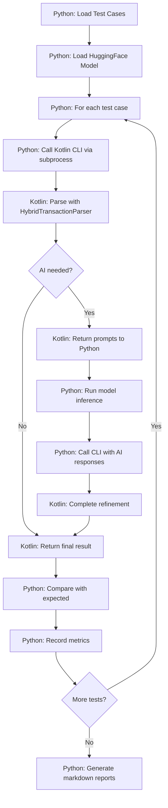

# Design Document

## Overview

The AI Parsing Evaluator is a development tool consisting of two main components: a Kotlin CLI wrapper that executes the production parsing pipeline, and a Python orchestrator that manages test execution, model inference, and results reporting. The design prioritizes simplicity, zero code duplication (uses exact production Kotlin code), and developer velocity (fast iteration on prompts and heuristics).

The system enables developers to test parsing changes quickly by running the complete 3-stage hybrid pipeline (heuristics → confidence evaluation → focused AI refinement) on their PC with HuggingFace models, eliminating the need to rebuild/deploy the Android app for every prompt tweak.

## Steering Document Alignment

### Technical Standards (tech.md)

**Kotlin/Android Standards:**
- CLI module follows same Kotlin conventions as `:app` module
- Reuses existing `HybridTransactionParser`, `HeuristicExtractor`, `GenAiGateway` interfaces
- Uses Gradle build system with proper module dependencies
- Follows same error handling patterns (Result types, sealed classes)

**Python Standards:**
- Simple script-based tool, no framework overhead
- Standard library + minimal dependencies (transformers, torch, pandas for markdown tables)
- Subprocess-based IPC (no complex JVM bridges or native libraries)
- CSV/Markdown output for human-readable results

**Hybrid AI Processing:**
- Maintains exact same 3-stage pipeline: heuristics → confidence evaluation → AI refinement
- Uses `ParsingContext` with configuration from existing `ConfigImportSchema` format
- Preserves confidence scoring and field-by-field refinement logic

### Project Structure (structure.md)

**Module Organization:**
```
/cli/                           # New Kotlin JVM module
  src/main/kotlin/
    com/voiceexpense/eval/
      CliMain.kt                # Entry point
      PythonGenAiGateway.kt     # Mock GenAiGateway

/evaluator/                     # New Python tool (not in app build)
  evaluate.py                   # Main orchestrator
  models.py                     # HuggingFace model loading
  test_cases.md                 # Test cases (markdown table)
  config.json                   # User configuration (ConfigImportSchema format)
  results/                      # Timestamped evaluation runs
  requirements.txt              # Python dependencies
  README.md                     # Usage documentation
```

**Separation from Android App:**
- `/cli/` is a separate Gradle module (JVM target, not Android)
- `/evaluator/` is completely outside Gradle build system
- Neither affects APK size or runtime dependencies

## Code Reuse Analysis

### Existing Components to Leverage

**Parsing Pipeline (100% reused):**
- `HybridTransactionParser` - Main orchestrator
- `HeuristicExtractor` - Stage 0 heuristic extraction
- `StagedParsingOrchestrator` - Stage 1 & 2 coordination
- `FocusedPromptBuilder` - Prompt generation for AI refinement
- `ValidationPipeline` - JSON response validation and normalization
- `ConfidenceScorer` - Confidence scoring logic
- `FieldConfidenceThresholds` - Threshold configuration

**Configuration:**
- `ConfigImportSchema` - Exact same JSON schema for user config
- `ParsingContext` - Context passing (categories, accounts, tags)

**Data Models:**
- `ParsedResult` - Transaction result model
- `HeuristicDraft` - Stage 0 output
- `ProcessingMethod`, `ProcessingStatistics` - Metrics

### Integration Points

**GenAiGateway Interface:**
- Existing: `MediaPipeGenAiClient` implements `GenAiGateway` for Android
- New: `PythonGenAiGateway` implements same interface for CLI
- Allows swapping model inference without changing parser logic

**Config Import:**
- CLI reads same JSON format as Android app's Settings → Import Config
- Python extracts labels to build `ParsingContext` for each test run

## Architecture

### High-Level Data Flow



### Modular Design Principles

**CLI Module:**
- Single purpose: I/O wrapper around parsing code
- Minimal dependencies: only `:app` module's parsing package
- No UI, no Android SDK dependencies
- Stateless: each invocation is independent

**Python Evaluator:**
- Separate concerns: orchestration (evaluate.py) vs model inference (models.py)
- Simple file-based I/O: markdown tables for test cases and results
- No database or complex state management

**Zero Duplication:**
- Parser logic stays in `:app/ai/parsing/` package
- CLI depends on `:app` as a library
- Python only handles orchestration and model inference

## Components and Interfaces

### Component 1: Kotlin CLI Wrapper

**Purpose:** Execute production parsing code from Python via subprocess

**File:** `/cli/src/main/kotlin/com/voiceexpense/eval/CliMain.kt`

**Interfaces:**
- **Input (stdin):** JSON object with `utterance`, `context`, optional `model_responses`
- **Output (stdout):** JSON object with `status`, `parsed`, `prompts_needed`, `stats`

**Dependencies:**
- `:app` module's `ai.parsing` package (compile-time dependency)
- `TransactionParser`, `HybridTransactionParser`
- `PythonGenAiGateway` (new, implements `GenAiGateway`)

**Reuses:**
- Entire parsing pipeline from `:app`
- Same data models (`ParsedResult`, `ParsingContext`)

**Behavior:**
1. Read JSON from stdin
2. Parse `utterance` and `context` into Kotlin types
3. Create `TransactionParser` with `PythonGenAiGateway`
4. If `model_responses` not provided:
   - Run Stage 0 & 1 (heuristics + confidence evaluation)
   - Return prompts for fields needing AI
5. If `model_responses` provided:
   - Inject responses into `PythonGenAiGateway`
   - Complete Stage 2 (AI refinement)
   - Return final `ParsedResult`
6. Write JSON to stdout and exit

**Error Handling:**
- Malformed JSON input → exit code 1, JSON error message
- Parser exceptions → exit code 1, JSON error with stack trace
- Timeouts handled by Python (kill process after 30s)

### Component 2: PythonGenAiGateway

**Purpose:** Mock `GenAiGateway` interface to delegate AI calls to Python

**File:** `/cli/src/main/kotlin/com/voiceexpense/eval/PythonGenAiGateway.kt`

**Interfaces:**
```kotlin
class PythonGenAiGateway : GenAiGateway {
    private val promptsCollected = mutableMapOf<String, String>()
    private val responsesProvided = mutableMapOf<String, String>()

    override fun isAvailable(): Boolean = true

    override suspend fun structured(prompt: String): Result<String> {
        val fieldKey = extractFieldKey(prompt) // Extract from prompt context
        return if (responsesProvided.containsKey(fieldKey)) {
            Result.success(responsesProvided[fieldKey]!!)
        } else {
            promptsCollected[fieldKey] = prompt
            Result.failure(NeedsAiException(fieldKey))
        }
    }

    fun injectResponses(responses: Map<String, String>) {
        responsesProvided.putAll(responses)
    }

    fun getCollectedPrompts(): Map<String, String> = promptsCollected
}
```

**Dependencies:** None (implements `GenAiGateway` interface)

**Reuses:** `GenAiGateway` interface contract

**Behavior:**
- First call (no responses): collect prompts and signal AI needed
- Second call (with responses): return injected responses for refinement

### Component 3: Python Orchestrator

**Purpose:** Coordinate test execution, model inference, and reporting

**File:** `/evaluator/evaluate.py`

**Interfaces:**
- CLI: `python evaluate.py [--model MODEL] [--test TEST_ID] [--config CONFIG_PATH]`
- Reads: `test_cases.md`, `config.json`
- Writes: `results/{timestamp}_results.md`, `results/{timestamp}_summary.md`

**Dependencies:**
- `subprocess` (stdlib) - CLI invocation
- `models.py` - Model loading and inference
- `pandas` (optional) - Markdown table parsing/generation

**Behavior:**
1. Load config.json → build base `ParsingContext`
2. Parse test_cases.md into list of test cases
3. Load HuggingFace model specified by `--model` flag
4. For each test case:
   a. Call CLI with utterance + context (no responses)
   b. If status == "needs_ai": run model inference on returned prompts
   c. Call CLI again with model responses
   d. Parse final result
   e. Compare each field with expected values
   f. Record pass/fail, timing, method used
5. Generate summary statistics (accuracy, timing, AI usage)
6. Write results and summary markdown tables

**Error Handling:**
- CLI timeout (>30s) → mark test as TIMEOUT
- CLI crashes → mark test as ERROR, log stderr
- Model inference fails → mark test as ERROR, continue to next

### Component 4: Model Inference

**Purpose:** Load and run HuggingFace models for AI refinement

**File:** `/evaluator/models.py`

**Interfaces:**
```python
class ModelInference:
    def __init__(self, model_name: str, quantize_8bit: bool = True):
        # Load model and tokenizer

    def generate(self, prompt: str, max_tokens: int = 256) -> str:
        # Run inference with proper chat template

    def generate_batch(self, prompts: List[str]) -> List[str]:
        # Batch inference for multiple fields
```

**Dependencies:**
- `transformers` - HuggingFace models
- `torch` - PyTorch backend
- `bitsandbytes` - 8-bit quantization

**Supported Models:**
- `google/gemma-3-1b-it` (default)
- `google/gemma-3n-E2B-it`

**Behavior:**
- Load model once at startup (cached for entire evaluation)
- Apply proper Gemma chat template for each prompt
- Generate with temperature=0 for deterministic results
- Return raw text response (CLI handles JSON validation)

## Data Models

### CLI Input Schema (stdin JSON)

```json
{
  "utterance": "string (required)",
  "context": {
    "allowedExpenseCategories": ["string"],
    "allowedIncomeCategories": ["string"],
    "allowedTags": ["string"],
    "allowedAccounts": ["string"],
    "recentMerchants": ["string"],
    "defaultDate": "YYYY-MM-DD"
  },
  "model_responses": {
    "field_name": "AI generated response"
  }
}
```

### CLI Output Schema (stdout JSON)

**Stage 1 (needs AI):**
```json
{
  "status": "needs_ai",
  "heuristic_results": {
    "amountUsd": 5.0,
    "merchant": null,
    "confidence": 0.6
  },
  "prompts_needed": [
    {
      "field": "merchant",
      "prompt": "Extract merchant from: 'coffee shop five dollars'..."
    }
  ],
  "stats": {
    "stage0_ms": 45,
    "stage1_ms": 5
  }
}
```

**Stage 2 (complete):**
```json
{
  "status": "complete",
  "parsed": {
    "amountUsd": 5.0,
    "merchant": "Coffee Shop",
    "type": "Expense",
    "expenseCategory": "Dining",
    "confidence": 0.85
  },
  "method": "AI",
  "stats": {
    "total_ms": 2341
  }
}
```

### Test Case Schema (markdown table in test_cases.md)

| Column | Type | Description |
|---|---|---|
| ID | string | Unique test identifier |
| Input | string | Transaction utterance |
| Amount | decimal | Expected amountUsd |
| Merchant | string | Expected merchant |
| Type | enum | Expense/Income/Transfer |
| Category | string | Expected category |
| Tags | comma-separated | Expected tags |
| Date | YYYY-MM-DD | Expected userLocalDate |
| Account | string | Expected account |
| Split Overall | decimal | Expected splitOverallChargedUsd |
| Notes | string | Test case notes |

### Results Schema (markdown table in results.md)

Columns: Test ID, Input, Overall Pass/Fail, and for each field: Actual/Expected, Match (✓/✗), plus Time (ms) and Method

### Configuration Schema (config.json)

Uses exact `ConfigImportSchema` format from app (see Requirement 7).

## Error Handling

### Error Scenarios

1. **CLI Process Crashes**
   - **Handling:** Python catches subprocess exception, logs stderr
   - **User Impact:** Test marked as ERROR in results, includes error message
   - **Recovery:** Continue to next test case

2. **CLI Timeout (>30 seconds)**
   - **Handling:** Python kills process after timeout
   - **User Impact:** Test marked as TIMEOUT in results
   - **Recovery:** Continue to next test case

3. **Model Inference Fails**
   - **Handling:** Catch exception in models.py, return error
   - **User Impact:** Test marked as ERROR, indicates model issue
   - **Recovery:** Continue to next test case

4. **Malformed Test Case**
   - **Handling:** Skip test case with warning
   - **User Impact:** Warning printed to console, test excluded from results
   - **Recovery:** Continue to next test case

5. **Config File Missing/Invalid**
   - **Handling:** Use empty context or fail fast with clear message
   - **User Impact:** Error message explains config issue
   - **Recovery:** Exit with usage instructions

6. **Invalid JSON from CLI**
   - **Handling:** Log raw output, mark test as ERROR
   - **User Impact:** Test shows parsing error in results
   - **Recovery:** Continue to next test case

## Validation Approach

Since this is a simple development helper tool, formal unit and integration tests are not included. Validation will be done through practical usage:

**Manual Validation:**
1. Copy production config from phone
2. Create test cases from real transaction history
3. Run evaluator with gemma-3-1b-it
4. Verify results match expected behavior
5. Change prompts in Kotlin code
6. Rebuild CLI and re-run
7. Confirm results change appropriately

**Expected Performance:**
- Single test case: <5 seconds
- 20 test cases: <2 minutes
- Model loading: <10 seconds

## File Organization

### CLI Module Structure

```
/cli/
├── build.gradle.kts           # Minimal JVM build, depend on :app
├── src/
│   └── main/
│       └── kotlin/
│           └── com/voiceexpense/eval/
│               ├── CliMain.kt              # ~100 lines
│               ├── PythonGenAiGateway.kt   # ~80 lines
│               ├── JsonModels.kt           # ~50 lines (input/output schemas)
│               └── ContextBuilder.kt       # ~40 lines (config → ParsingContext)
```

### Python Evaluator Structure

```
/evaluator/
├── evaluate.py                 # ~250 lines (main orchestrator)
├── models.py                   # ~100 lines (HuggingFace loading)
├── test_cases.md               # Markdown table (user-editable)
├── config.json                 # ConfigImportSchema (copy from phone)
├── requirements.txt            # 3-4 dependencies
├── README.md                   # Setup and usage instructions
├── .gitignore                  # Ignore results/
└── results/                    # Timestamped runs (gitignored)
    ├── 2025-10-16_143045_results.md
    └── 2025-10-16_143045_summary.md
```

## Build Configuration

### CLI Module (build.gradle.kts)

```kotlin
plugins {
    kotlin("jvm")
    application
}

dependencies {
    implementation(project(":app"))  // Access to parsing code
    implementation("com.squareup.moshi:moshi-kotlin:1.15.1")
    implementation("org.jetbrains.kotlinx:kotlinx-coroutines-core:1.8.1")
}

application {
    mainClass.set("com.voiceexpense.eval.CliMainKt")
}

tasks.jar {
    manifest {
        attributes["Main-Class"] = "com.voiceexpense.eval.CliMainKt"
    }
    // Fat JAR with all dependencies
    from(configurations.runtimeClasspath.get().map { if (it.isDirectory) it else zipTree(it) })
    duplicatesStrategy = DuplicatesStrategy.EXCLUDE
}
```

### Python Dependencies (requirements.txt)

```
transformers>=4.50.0
torch>=2.0.0
bitsandbytes>=0.41.0
pandas>=2.0.0  # Optional, for markdown table handling
```

## Deployment and Usage

### Setup (One-time)

1. Build CLI JAR:
   ```bash
   cd /workspace/voice-expense-tracker
   ./gradlew :cli:build
   ```

2. Install Python dependencies:
   ```bash
   cd evaluator
   pip install -r requirements.txt
   ```

3. Copy config from phone to `evaluator/config.json`

### Usage Workflow

1. **Create/Edit Test Cases:**
   - Open `evaluator/test_cases.md`
   - Add rows to markdown table
   - Save file

2. **Run Evaluation:**
   ```bash
   cd evaluator
   python evaluate.py --model google/gemma-3-1b-it
   ```

3. **Review Results:**
   - Open `results/{timestamp}_results.md` to see per-test results
   - Open `results/{timestamp}_summary.md` to see aggregate metrics
   - Filter for FAIL in results table to focus on errors

4. **Iterate on Prompts:**
   - Edit prompts in Kotlin code (e.g., `FocusedPromptBuilder.kt`)
   - Rebuild CLI: `./gradlew :cli:build`
   - Re-run evaluation
   - Compare new summary with baseline

### Performance Targets

- CLI startup: <2s
- Model loading: <10s (one-time per evaluation run)
- Single test case: <5s
- 20 test cases: <2 minutes total
- Prompt iteration cycle: <1 minute (edit → build → run)
