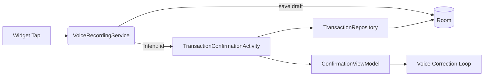

# Design Document

## Overview

This feature wires the “capture → confirmation” navigation so that as soon as a draft transaction is created by the voice capture service, the confirmation screen opens with that draft. The service passes the new transaction id via an intent extra to `TransactionConfirmationActivity`, which loads the draft from the repository and starts the voice correction loop. The existing local broadcast remains for optional listeners but is not required for navigation.

## Steering Document Alignment

### Technical Standards (tech.md)
- Kotlin, MVVM, Hilt DI: Service triggers Activity, Activity delegates to ViewModel and Repository.
- Offline-first: No network involved; repository read is local Room.
- Privacy-first: No added cloud calls; only local navigation and data access.
- WorkManager remains responsible for sync; unchanged by this feature.

### Project Structure (structure.md)
- Service in `service/voice/`; confirmation UI in `ui/confirmation/`; data access via `data/repository/`.
- Extras and keys centralize under the service/Activity contract; repository exposes `getById(id)`.

## Code Reuse Analysis
- Reuse `VoiceRecordingService` as capture orchestrator; add navigation trigger after draft save.
- Reuse `TransactionConfirmationActivity` and `ConfirmationViewModel`; Activity loads draft by id then calls `viewModel.setDraft(...)`.
- Reuse `TransactionRepository` to fetch transaction by id and to handle confirm/queue actions later.

### Existing Components to Leverage
- `TransactionRepository`: add a `suspend fun getById(id: String)` to load the draft.
- `VoiceRecordingService`: after saving the draft, form an `Intent` with `EXTRA_TRANSACTION_ID` and start the Activity.
- `TransactionConfirmationActivity`: read the extra, fetch the draft, initialize the loop.

### Integration Points
- Room/DAO via repository for lookup by id.
- Android Activity launch from a foreground service using `FLAG_ACTIVITY_NEW_TASK`.

## Architecture

- Service-to-Activity contract with a single extra key `EXTRA_TRANSACTION_ID` (UUID string).
- Debounce to avoid duplicate launches for the same id within a short window.
- Activity performs repository lookup in a coroutine; handles missing id by showing a toast and finishing.

### Modular Design Principles
- Single File Responsibility: Service remains capture + navigation trigger; Activity handles UI and draft loading; Repository handles data access.
- Component Isolation: No direct DB access from the service; no navigation logic in the repository.
- Service Layer Separation: UI layer (Activity/ViewModel) consumes data from repository.

## Components and Interfaces

### VoiceRecordingService (update)
- Purpose: After creating a draft, start confirmation.
- Interfaces:
  - Intent action constants (unchanged)
  - Launch: `Intent(context, TransactionConfirmationActivity).putExtra(EXTRA_TRANSACTION_ID, id)` with `FLAG_ACTIVITY_NEW_TASK`.
- Dependencies: `TransactionRepository` (already injected), Android Context.
- Reuses: Existing capture and parsing flow; existing `ACTION_DRAFT_READY` broadcast remains.

### TransactionConfirmationActivity (update)
- Purpose: Load the draft by id and begin the loop.
- Interfaces:
  - Reads `EXTRA_TRANSACTION_ID` from intent.
  - Coroutine to fetch draft via repository; on success calls `viewModel.setDraft(draft)`; on failure shows a brief toast and `finish()`.
- Dependencies: `TransactionRepository`, `ConfirmationViewModel`.
- Reuses: Existing UI and ViewModel wiring.

### TransactionRepository (update)
- Purpose: Provide lookup by id.
- Interfaces:
  - `suspend fun getById(id: String): Transaction?`
- Dependencies: `TransactionDao`.

## Data Models

### Transaction (existing)
- id: String (UUID), status: DRAFT/CONFIRMED/QUEUED/POSTED/FAILED, other fields unchanged.

## Error Handling

### Error Scenarios
1. Missing or empty `EXTRA_TRANSACTION_ID`.
   - Handling: Show toast “Could not open draft”, finish Activity.
   - User Impact: Returns to previous context.
2. Draft not found by id (e.g., deleted or not yet committed).
   - Handling: Same as above; log at debug level only.
   - User Impact: Minimal; no crash.
3. Multiple launches for same id due to rapid events.
   - Handling: Debounce in service (track last launched id + timestamp) or rely on `singleTop` Activity config; do not launch duplicates.
   - User Impact: Prevents duplicate screens.

## Testing Strategy

### Unit Testing
- Repository: `getById` returns expected item; null on missing id.

### Integration Testing
- Service: simulate draft save and verify an intent with `EXTRA_TRANSACTION_ID` is issued (instrumented test or Robolectric ShadowApplication capture).
- Activity: with a fake repository returning a draft, verify `viewModel.setDraft` path; with missing id, verify toast + finish.

### End-to-End Testing
- Widget → Service → Activity: tap widget, stub ASR/parser to create draft, ensure confirmation opens and loop starts.

