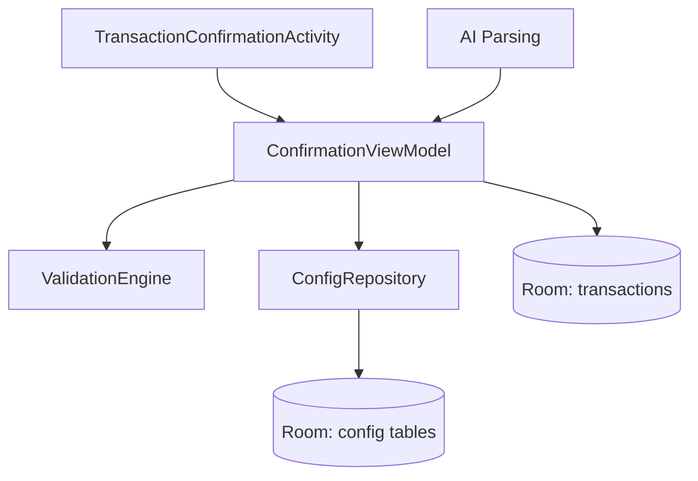

# Design Document

## Overview

We will upgrade the Transaction Confirmation form to a configurable, validation-rich UI that maps 1:1 to the CSV schema and supports Expense, Income, and Transfer with proper controls. The implementation adds structured configuration (categories, accounts, tags) via Room, introduces transfer-specific fields to the Transaction entity with safe migrations, and refactors UI to use Material pickers, dropdowns, and a multi-select dialog with real-time validation. We preserve on-device-first architecture and existing voice/AI parsing flows.

## Steering Document Alignment

### Technical Standards (tech.md)
- Kotlin + AndroidX + Material: reuse existing stack (AppCompat, MaterialToolbar).
- Room for local storage and migrations; ViewModel for state; coroutines/Flow for async updates.
- Validation centralized in a dedicated component to avoid duplicating rules in views.

### Project Structure (structure.md)
- Keep packages under `ui/confirmation`, `ui/common`, `data/`, `ai/` as-is.
- Add `data/config/` for configuration models + DAO + repository.
- Add `ui/components/` for reusable pickers (date, dropdown, tag selector) if needed, or inline in confirmation for scope control.

## Code Reuse Analysis

Existing Components to Leverage
- TransactionConfirmationActivity + ConfirmationViewModel: extend to drive new controls, conditional visibility, and validation state.
- AppDatabase: extend with new tables and a migration.
- SettingsActivity: entry point for configuration management; extend with new views for dropdown config.

Integration Points
- Database/Storage: Room entity and migration for `Transaction` (add transfer fields) and new config tables. SharedPreferences used only for small defaults if necessary; prefer Room.
- AI Parsing: continue pre-filling draft values; ViewModel merges AI values with user selections and validation.

## Architecture

- Presentation: Activity (view) + ViewModel manage UI state, conditional visibility, and validation state.
- Domain: ValidationEngine applies rules based on `TransactionType` and field values; emits field errors.
- Data: ConfigRepository exposes option sets as Flows; caches in Room.
- Storage: Room entities for option sets + migration for `Transaction` transfer fields.

Mermaid

## Components and Interfaces

### ConfigRepository
- Purpose: CRUD and observe option sets (Expense Categories, Income Categories, Transfer Categories, Accounts, Tags). Provide defaults.
- Interfaces:
  - `fun categories(type: CategoryType): Flow<List<ConfigOption>>`
  - `suspend fun upsert(option: ConfigOption)`
  - `suspend fun delete(id: String)`
  - `fun tags(): Flow<List<ConfigOption>>`
  - `fun defaultFor(field: DefaultField): Flow<String?>`
  - `suspend fun setDefault(field: DefaultField, optionId: String?)`
- Dependencies: Room DAOs.

### ValidationEngine
- Purpose: Evaluate field-level and business logic rules in real time.
- Interfaces:
  - `fun validate(t: Transaction): ValidationResult` (fieldErrors map, formValid bool)
  - Convenience: `fun validateAmount(amount: BigDecimal?): FieldError?`, etc.
- Dependencies: none; pure logic.

### UI Controls
- DatePicker field: opens `DatePickerDialog`, displays MM/DD, stores ISO in model.
- Dropdown field: Material exposed dropdown (AutoCompleteTextView) or Spinner bound to ConfigRepository flows; "+ Add New" option routes to inline dialog or Settings.
- Tags selector: Dialog with multi-select list; selected rendered as Material chips.

### Settings: Dropdown Configuration
- Screens within SettingsActivity: list + add/edit/delete/reorder for each option set.
- Default selection management per set.

## Data Models

### Transaction (existing + new)
- Add:
  - `transferCategory: String?`
  - `transferDestination: String?`
- Room Migration `from N to N+1` to add nullable columns with defaults.

### Configuration
- `ConfigOption` entity
  - `id: String`
  - `type: CategoryType` (ExpenseCategory, IncomeCategory, TransferCategory, Account, Tag)
  - `label: String`
  - `position: Int` (for ordering)
  - `active: Boolean` (soft delete)
- `DefaultValue` entity
  - `field: DefaultField` (DateDefault not needed; today by default; others for category/account)
  - `optionId: String?`

## Error Handling

Error Scenarios
1. Invalid numeric input.
   - Handling: show inline error, disable Confirm.
   - Impact: field message, no crash.
2. Migration failure.
   - Handling: provide tested migration; on failure, log and block upgrade with message; advise backup.
3. Missing required fields by type.
   - Handling: ValidationEngine flags, confirm disabled with specific message.

## Testing Strategy

Unit Testing
- ValidationEngine: all rules (required fields, splitwise overall ≥ amount, transfer dependencies).
- ConfigRepository: CRUD, ordering, defaults.

Integration Testing
- ConfirmationViewModel: conditional visibility and validation gating Confirm.
- Room migration test: add columns for transfer; ensure existing rows preserved.

End-to-End Testing
- UI tests for date picker, dropdowns, multi-select tags; type switching hides/shows fields; confirm disabled/enabled transitions.
