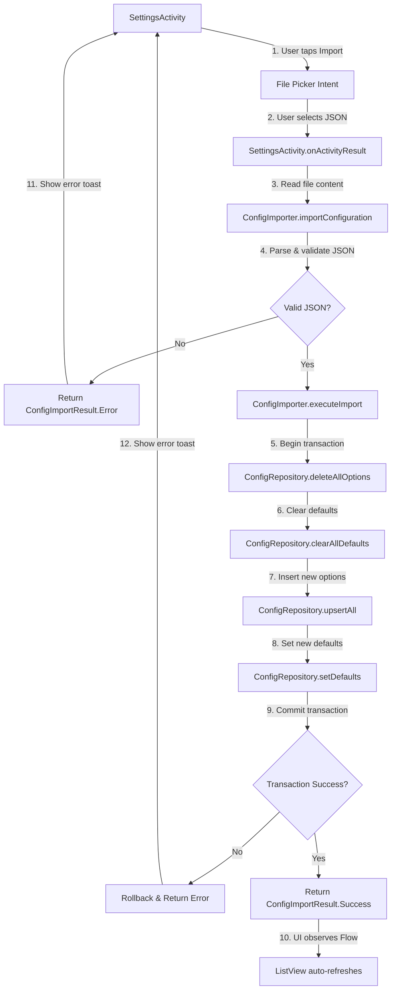

# Design Document

## Overview

The configuration import feature enables users to restore or initialize their dropdown configurations (categories, accounts, tags) from a JSON file. The implementation follows a modular architecture with a dedicated utility class for JSON parsing/validation, leveraging the existing ConfigRepository for database operations, and integrating seamlessly into the existing SettingsActivity UI.

This feature complements the existing manual dropdown configuration workflow by providing a faster, more reliable way to manage complex category hierarchies and restore settings after device changes.

## Steering Document Alignment

### Technical Standards (tech.md)

**Architecture Pattern**: MVVM with Repository pattern
- Reuses existing `ConfigRepository` for all database operations
- Follows dependency injection via Hilt for testability
- Separates UI logic (SettingsActivity), business logic (ConfigImporter), and data access (ConfigRepository)

**Data Storage**: Room Database with Kotlin Coroutines
- Atomic transaction using `@Transaction` annotation for all-or-nothing import
- Leverages existing `ConfigDao.upsertOptions()` and `setDefault()` methods
- No new database tables required; works with existing schema

**Error Handling**: Sealed classes for type-safe results
- `ConfigImportResult` sealed class with `Success`, `InvalidJson`, `MissingFields`, `DatabaseError` states
- Specific error messages for actionable user feedback

**Performance**: Background processing with coroutines
- File I/O and JSON parsing on IO dispatcher
- Database operations on IO dispatcher
- UI updates on Main dispatcher

### Project Structure (structure.md)

**File Organization**:
```
app/src/main/java/com/voiceexpense/
├── data/
│   └── config/
│       ├── ConfigImporter.kt          # New: JSON import logic
│       ├── ConfigImportModels.kt      # New: JSON data models
│       ├── ConfigRepository.kt        # Existing: Add deleteAllOptions()
│       ├── ConfigDao.kt              # Existing: Add @Query DELETE ALL
│       └── ConfigOption.kt           # Existing: No changes
├── ui/
│   └── common/
│       └── SettingsActivity.kt       # Existing: Add import button + file picker
└── util/
    └── JsonValidator.kt              # New: Optional validation helpers
```

**Naming Conventions**:
- Utility class: `ConfigImporter` (PascalCase)
- Data models: `ConfigImportSchema`, `ConfigImportResult` (PascalCase)
- Functions: `importConfiguration`, `validateSchema` (camelCase)
- Constants: `MIME_TYPE_JSON`, `MAX_FILE_SIZE_BYTES` (UPPER_SNAKE_CASE)

## Code Reuse Analysis

### Existing Components to Leverage

- **ConfigRepository**: Core data access layer
  - `upsertAll(options: List<ConfigOption>)`: Bulk insert imported options
  - `setDefault(field: DefaultField, optionId: String?)`: Set imported defaults
  - `options(type: ConfigType)`: Already provides Flow for UI refresh
  - **NEW**: `deleteAllOptions()`: Clear all existing configurations

- **ConfigDao**: Room database interface
  - `upsertOptions(options: List<ConfigOption>)`: Batch upsert with REPLACE conflict strategy
  - `setDefault(value: DefaultValue)`: Update default values
  - **NEW**: `@Query("DELETE FROM config_options")`: Clear all options
  - **NEW**: `@Query("DELETE FROM default_values")`: Clear all defaults

- **ConfigOption & DefaultValue**: Existing entities
  - Reuse as-is; JSON models map directly to these entities

- **SettingsActivity**: Existing configuration UI
  - Add "Import Configuration" button below "Set Default" button
  - Reuse existing Flow observers for automatic UI refresh after import

### Integration Points

- **Android Storage Access Framework**: `ACTION_OPEN_DOCUMENT` intent for file selection
  - MIME type filter: `application/json`
  - Request code: `REQUEST_CODE_IMPORT_CONFIG = 1001`

- **Moshi JSON Library**: Already in project dependencies (used by AppsScriptClient)
  - Reuse for type-safe JSON parsing with Kotlin data classes
  - `@JsonClass(generateAdapter = true)` annotations for efficiency

- **Room Database Transaction**: Atomic import operation
  - Use `@Transaction` annotation for rollback on error
  - Ensures consistency (all configs imported or none)

## Architecture



### Modular Design Principles

- **Single File Responsibility**:
  - `ConfigImporter.kt`: JSON parsing, validation, orchestration
  - `ConfigImportModels.kt`: JSON schema data classes only
  - `ConfigRepository.kt`: Database operations (add delete methods)
  - `SettingsActivity.kt`: UI and user interaction

- **Component Isolation**:
  - ConfigImporter has no Android UI dependencies (testable with JUnit)
  - Uses dependency injection for ConfigRepository (mockable)
  - Pure function for JSON parsing (no side effects)

- **Service Layer Separation**:
  - Presentation: SettingsActivity
  - Business Logic: ConfigImporter
  - Data Access: ConfigRepository + ConfigDao

## Components and Interfaces

### Component 1: ConfigImportModels

**Purpose**: Define JSON schema structure with Moshi annotations for type-safe parsing

**File**: `app/src/main/java/com/voiceexpense/data/config/ConfigImportModels.kt`

```kotlin
@JsonClass(generateAdapter = true)
data class ConfigImportSchema(
    @Json(name = "ExpenseCategory") val expenseCategory: List<ConfigOptionJson>,
    @Json(name = "IncomeCategory") val incomeCategory: List<ConfigOptionJson>,
    @Json(name = "TransferCategory") val transferCategory: List<ConfigOptionJson>,
    @Json(name = "Account") val account: List<ConfigOptionJson>,
    @Json(name = "Tag") val tag: List<ConfigOptionJson>,
    @Json(name = "defaults") val defaults: ConfigDefaultsJson?
)

@JsonClass(generateAdapter = true)
data class ConfigOptionJson(
    @Json(name = "label") val label: String,
    @Json(name = "position") val position: Int? = null,
    @Json(name = "active") val active: Boolean = true
)

@JsonClass(generateAdapter = true)
data class ConfigDefaultsJson(
    @Json(name = "defaultExpenseCategory") val defaultExpenseCategory: String? = null,
    @Json(name = "defaultIncomeCategory") val defaultIncomeCategory: String? = null,
    @Json(name = "defaultTransferCategory") val defaultTransferCategory: String? = null,
    @Json(name = "defaultAccount") val defaultAccount: String? = null
)

sealed class ConfigImportResult {
    data class Success(val optionsImported: Int) : ConfigImportResult()
    data class InvalidJson(val message: String) : ConfigImportResult()
    data class ValidationError(val message: String) : ConfigImportResult()
    data class DatabaseError(val throwable: Throwable) : ConfigImportResult()
    data class FileReadError(val throwable: Throwable) : ConfigImportResult()
}
```

**Interfaces**: Data classes (no methods)

**Dependencies**: Moshi JSON library

**Reuses**: None (pure data models)

---

### Component 2: ConfigImporter

**Purpose**: Orchestrate JSON import process: read file, parse, validate, and execute database transaction

**File**: `app/src/main/java/com/voiceexpense/data/config/ConfigImporter.kt`

```kotlin
class ConfigImporter @Inject constructor(
    private val configRepository: ConfigRepository,
    private val moshi: Moshi
) {
    companion object {
        private const val MAX_FILE_SIZE_BYTES = 10 * 1024 * 1024 // 10 MB
    }

    suspend fun importConfiguration(
        fileUri: Uri,
        contentResolver: ContentResolver
    ): ConfigImportResult = withContext(Dispatchers.IO) {
        // 1. Read file content
        val jsonString = try {
            contentResolver.openInputStream(fileUri)?.use { inputStream ->
                if (inputStream.available() > MAX_FILE_SIZE_BYTES) {
                    return@withContext ConfigImportResult.ValidationError("File too large (max 10MB)")
                }
                inputStream.bufferedReader().readText()
            } ?: return@withContext ConfigImportResult.FileReadError(IllegalStateException("Cannot open file"))
        } catch (e: Exception) {
            return@withContext ConfigImportResult.FileReadError(e)
        }

        // 2. Parse JSON
        val schema = try {
            val adapter = moshi.adapter(ConfigImportSchema::class.java)
            adapter.fromJson(jsonString)
                ?: return@withContext ConfigImportResult.InvalidJson("Empty or null JSON")
        } catch (e: Exception) {
            return@withContext ConfigImportResult.InvalidJson(e.message ?: "Malformed JSON")
        }

        // 3. Validate schema
        val validation = validateSchema(schema)
        if (validation != null) {
            return@withContext validation
        }

        // 4. Execute import transaction
        executeImport(schema)
    }

    private fun validateSchema(schema: ConfigImportSchema): ConfigImportResult? {
        // Check all lists are not empty (at least one option per type)
        if (schema.expenseCategory.isEmpty()) return ConfigImportResult.ValidationError("ExpenseCategory list is empty")
        if (schema.incomeCategory.isEmpty()) return ConfigImportResult.ValidationError("IncomeCategory list is empty")
        if (schema.transferCategory.isEmpty()) return ConfigImportResult.ValidationError("TransferCategory list is empty")
        if (schema.account.isEmpty()) return ConfigImportResult.ValidationError("Account list is empty")
        if (schema.tag.isEmpty()) return ConfigImportResult.ValidationError("Tag list is empty")

        // Validate all labels are non-blank
        val allOptions = schema.expenseCategory + schema.incomeCategory +
                        schema.transferCategory + schema.account + schema.tag
        allOptions.forEachIndexed { index, option ->
            if (option.label.isBlank()) {
                return ConfigImportResult.ValidationError("Option at index $index has blank label")
            }
        }

        return null // Valid
    }

    private suspend fun executeImport(schema: ConfigImportSchema): ConfigImportResult {
        return try {
            configRepository.importConfiguration(schema)
            val totalOptions = schema.expenseCategory.size + schema.incomeCategory.size +
                              schema.transferCategory.size + schema.account.size + schema.tag.size
            ConfigImportResult.Success(optionsImported = totalOptions)
        } catch (e: Exception) {
            ConfigImportResult.DatabaseError(e)
        }
    }
}
```

**Interfaces**:
- `suspend fun importConfiguration(fileUri: Uri, contentResolver: ContentResolver): ConfigImportResult`

**Dependencies**: ConfigRepository, Moshi, Android ContentResolver

**Reuses**: ConfigRepository for all database operations

---

### Component 3: ConfigRepository Extensions

**Purpose**: Add batch delete operations and transaction-based import method

**File**: `app/src/main/java/com/voiceexpense/data/config/ConfigRepository.kt` (extend existing)

**New Methods**:
```kotlin
// Add to existing ConfigRepository class
suspend fun deleteAllOptions() = dao.deleteAllOptions()
suspend fun clearAllDefaults() = dao.clearAllDefaults()

@Transaction
suspend fun importConfiguration(schema: ConfigImportSchema) {
    // 1. Delete all existing data
    deleteAllOptions()
    clearAllDefaults()

    // 2. Convert JSON to entities and insert
    val allOptions = mutableListOf<ConfigOption>()

    schema.expenseCategory.forEachIndexed { index, json ->
        allOptions.add(json.toEntity(ConfigType.ExpenseCategory, index))
    }
    schema.incomeCategory.forEachIndexed { index, json ->
        allOptions.add(json.toEntity(ConfigType.IncomeCategory, index))
    }
    schema.transferCategory.forEachIndexed { index, json ->
        allOptions.add(json.toEntity(ConfigType.TransferCategory, index))
    }
    schema.account.forEachIndexed { index, json ->
        allOptions.add(json.toEntity(ConfigType.Account, index))
    }
    schema.tag.forEachIndexed { index, json ->
        allOptions.add(json.toEntity(ConfigType.Tag, index))
    }

    upsertAll(allOptions)

    // 3. Set defaults if provided
    schema.defaults?.let { defaults ->
        defaults.defaultExpenseCategory?.let { label ->
            val optionId = allOptions.find { it.type == ConfigType.ExpenseCategory && it.label == label }?.id
            optionId?.let { setDefault(DefaultField.DefaultExpenseCategory, it) }
        }
        defaults.defaultIncomeCategory?.let { label ->
            val optionId = allOptions.find { it.type == ConfigType.IncomeCategory && it.label == label }?.id
            optionId?.let { setDefault(DefaultField.DefaultIncomeCategory, it) }
        }
        defaults.defaultTransferCategory?.let { label ->
            val optionId = allOptions.find { it.type == ConfigType.TransferCategory && it.label == label }?.id
            optionId?.let { setDefault(DefaultField.DefaultTransferCategory, it) }
        }
        defaults.defaultAccount?.let { label ->
            val optionId = allOptions.find { it.type == ConfigType.Account && it.label == label }?.id
            optionId?.let { setDefault(DefaultField.DefaultAccount, it) }
        }
    }
}

// Extension function to convert JSON to entity
private fun ConfigOptionJson.toEntity(type: ConfigType, index: Int): ConfigOption {
    return ConfigOption(
        id = UUID.randomUUID().toString(),
        type = type,
        label = this.label,
        position = this.position ?: index,
        active = this.active
    )
}
```

**Dependencies**: ConfigDao

**Reuses**: Existing DAO methods

---

### Component 4: ConfigDao Extensions

**Purpose**: Add SQL queries for batch delete operations

**File**: `app/src/main/java/com/voiceexpense/data/config/ConfigDao.kt` (extend existing)

**New Methods**:
```kotlin
@Query("DELETE FROM config_options")
suspend fun deleteAllOptions(): Int

@Query("DELETE FROM default_values")
suspend fun clearAllDefaults(): Int
```

**Interfaces**: Room @Dao methods

**Dependencies**: Room database

**Reuses**: Existing Room infrastructure

---

### Component 5: SettingsActivity UI Integration

**Purpose**: Add Import button and file picker integration

**File**: `app/src/main/java/com/voiceexpense/ui/common/SettingsActivity.kt` (extend existing)

**UI Changes** (in `activity_settings.xml`):
```xml
<!-- Add after btn_set_default button -->
<Button
    android:id="@+id/btn_import_config"
    android:layout_width="match_parent"
    android:layout_height="wrap_content"
    android:minHeight="48dp"
    android:layout_marginTop="16dp"
    android:text="@string/import_configuration" />
```

**Activity Changes**:
```kotlin
@Inject lateinit var configImporter: ConfigImporter

companion object {
    private const val REQUEST_CODE_IMPORT_CONFIG = 1001
    private const val MIME_TYPE_JSON = "application/json"
}

// In onCreate after existing button setup:
val importBtn: Button = findViewById(R.id.btn_import_config)
importBtn.setOnClickListener {
    val intent = Intent(Intent.ACTION_OPEN_DOCUMENT).apply {
        addCategory(Intent.CATEGORY_OPENABLE)
        type = MIME_TYPE_JSON
    }
    startActivityForResult(intent, REQUEST_CODE_IMPORT_CONFIG)
}

override fun onActivityResult(requestCode: Int, resultCode: Int, data: Intent?) {
    super.onActivityResult(requestCode, resultCode, data)
    if (requestCode == REQUEST_CODE_IMPORT_CONFIG && resultCode == Activity.RESULT_OK) {
        data?.data?.let { uri ->
            showImportConfirmationDialog(uri)
        }
    }
}

private fun showImportConfirmationDialog(fileUri: Uri) {
    AlertDialog.Builder(this)
        .setTitle(R.string.import_confirm_title)
        .setMessage(R.string.import_confirm_message)
        .setPositiveButton(R.string.replace) { _, _ ->
            executeImport(fileUri)
        }
        .setNegativeButton(R.string.cancel, null)
        .show()
}

private fun executeImport(fileUri: Uri) {
    lifecycleScope.launch(Dispatchers.IO) {
        val result = configImporter.importConfiguration(fileUri, contentResolver)
        withContext(Dispatchers.Main) {
            when (result) {
                is ConfigImportResult.Success -> {
                    Toast.makeText(
                        this@SettingsActivity,
                        getString(R.string.import_success, result.optionsImported),
                        Toast.LENGTH_LONG
                    ).show()
                }
                is ConfigImportResult.InvalidJson -> {
                    Toast.makeText(
                        this@SettingsActivity,
                        getString(R.string.import_error_invalid_json, result.message),
                        Toast.LENGTH_LONG
                    ).show()
                }
                is ConfigImportResult.ValidationError -> {
                    Toast.makeText(
                        this@SettingsActivity,
                        getString(R.string.import_error_validation, result.message),
                        Toast.LENGTH_LONG
                    ).show()
                }
                is ConfigImportResult.DatabaseError -> {
                    Toast.makeText(
                        this@SettingsActivity,
                        getString(R.string.import_error_database, result.throwable.message),
                        Toast.LENGTH_LONG
                    ).show()
                }
                is ConfigImportResult.FileReadError -> {
                    Toast.makeText(
                        this@SettingsActivity,
                        getString(R.string.import_error_file_read, result.throwable.message),
                        Toast.LENGTH_LONG
                    ).show()
                }
            }
        }
    }
}
```

**Dependencies**: ConfigImporter (injected via Hilt)

**Reuses**: Existing Flow observers automatically refresh UI after import

## Data Models

### ConfigImportSchema (JSON Input)
```kotlin
data class ConfigImportSchema(
    val expenseCategory: List<ConfigOptionJson>,
    val incomeCategory: List<ConfigOptionJson>,
    val transferCategory: List<ConfigOptionJson>,
    val account: List<ConfigOptionJson>,
    val tag: List<ConfigOptionJson>,
    val defaults: ConfigDefaultsJson?
)
```

**JSON Example**:
```json
{
  "ExpenseCategory": [
    {"label": "Food", "position": 0, "active": true},
    {"label": "Transport", "position": 1, "active": true}
  ],
  "IncomeCategory": [
    {"label": "Salary", "position": 0, "active": true}
  ],
  "TransferCategory": [
    {"label": "Savings", "position": 0, "active": true}
  ],
  "Account": [
    {"label": "Chase Checking", "position": 0, "active": true}
  ],
  "Tag": [
    {"label": "Work", "position": 0, "active": true}
  ],
  "defaults": {
    "defaultExpenseCategory": "Food",
    "defaultAccount": "Chase Checking"
  }
}
```

### ConfigImportResult (Return Type)
```kotlin
sealed class ConfigImportResult {
    data class Success(val optionsImported: Int) : ConfigImportResult()
    data class InvalidJson(val message: String) : ConfigImportResult()
    data class ValidationError(val message: String) : ConfigImportResult()
    data class DatabaseError(val throwable: Throwable) : ConfigImportResult()
    data class FileReadError(val throwable: Throwable) : ConfigImportResult()
}
```

## Error Handling

### Error Scenarios

1. **File Not Accessible**
   - **Handling**: Catch IOException in `contentResolver.openInputStream()`
   - **User Impact**: Toast message "Failed to read file: [error details]"

2. **Invalid JSON Syntax**
   - **Handling**: Catch JsonDataException from Moshi adapter
   - **User Impact**: Toast message "Invalid JSON format: [parse error]"

3. **Missing Required Fields**
   - **Handling**: Check for empty lists in `validateSchema()`
   - **User Impact**: Toast message "Missing required configuration sections"

4. **Blank Labels**
   - **Handling**: Validate `label.isBlank()` in `validateSchema()`
   - **User Impact**: Toast message "Invalid option format: blank label at index X"

5. **Database Transaction Failure**
   - **Handling**: Room transaction auto-rollback on exception
   - **User Impact**: Toast message "Import failed: [database error]" + no changes applied

6. **File Too Large**
   - **Handling**: Check `inputStream.available()` before reading
   - **User Impact**: Toast message "File too large (max 10MB)"

7. **Default References Non-Existent Label**
   - **Handling**: Silent ignore (proceed with import, skip invalid default)
   - **User Impact**: Import succeeds, affected default field remains unset

8. **User Cancels File Picker**
   - **Handling**: `onActivityResult` checks `RESULT_OK`
   - **User Impact**: No action, returns to Settings

## Testing Strategy

### Unit Testing

**Test File**: `app/src/test/java/com/voiceexpense/data/config/ConfigImporterTest.kt`

**Test Cases**:
1. `testValidJsonParsing_Success()`: Valid JSON → ConfigImportSchema
2. `testInvalidJsonSyntax_ReturnsInvalidJson()`: Malformed JSON → InvalidJson result
3. `testEmptyExpenseCategory_ReturnsValidationError()`: Empty list → ValidationError
4. `testBlankLabel_ReturnsValidationError()`: Blank label → ValidationError
5. `testValidSchemaWithDefaults_ImportsSuccessfully()`: Full valid JSON → Success
6. `testDefaultReferencesNonExistentLabel_IgnoresDefault()`: Invalid default reference → Success with default skipped
7. `testFileSizeExceedsLimit_ReturnsValidationError()`: 11MB file → ValidationError

**Mocking Strategy**:
- Mock `ConfigRepository` with Mockito
- Mock `ContentResolver` with fake URI and InputStream
- Use real Moshi instance for JSON parsing tests

---

### Integration Testing

**Test File**: `app/src/androidTest/java/com/voiceexpense/ui/common/SettingsConfigImportTest.kt`

**Test Cases**:
1. `testImportButton_LaunchesFilePicker()`: Click import button → file picker intent launched
2. `testConfirmationDialog_ShowsBeforeImport()`: Select file → confirmation dialog displayed
3. `testImportSuccess_RefreshesUI()`: Confirm import → ListView updates with new options
4. `testImportError_ShowsToast()`: Invalid file → error toast displayed
5. `testDatabaseTransactionRollback_NoChangesOnError()`: Simulate DB error → original data preserved

**Testing Approach**:
- Use Espresso for UI interactions
- Use `ActivityScenarioRule` for SettingsActivity
- Pre-populate database with test data to verify deletion
- Use `IdlingResource` for coroutine synchronization

---

### End-to-End Testing

**User Scenarios**:
1. **Happy Path**: User selects valid JSON → confirms → sees success toast → verifies new options in dropdowns
2. **Invalid JSON**: User selects malformed JSON → sees error toast → original options unchanged
3. **Cancel Import**: User selects file → cancels confirmation → original options unchanged
4. **Default Import**: User imports JSON with defaults → verifies default selections in form UI
5. **Large Config**: User imports 50+ options per type → all options appear correctly ordered

**Manual Testing Checklist**:
- [ ] Import button visible in Settings below "Set Default"
- [ ] File picker filters to JSON files only
- [ ] Confirmation dialog shows correct message
- [ ] Success toast shows number of options imported
- [ ] Error toasts show specific error messages
- [ ] UI refreshes automatically after import (no manual navigation needed)
- [ ] Defaults are applied correctly after import
- [ ] Transaction rollback works (simulate DB error via debugger)
