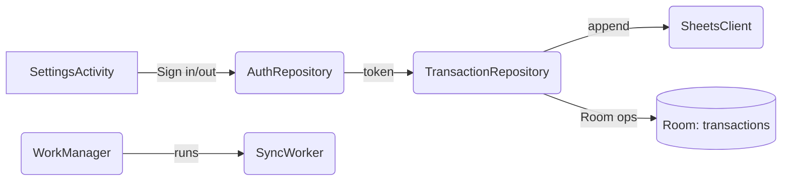

# Design Document

## Overview

Add Google Sign-In based authorization and robust Google Sheets sync for confirmed transactions. The app will provide a minimal sign-in/out UI, securely derive and cache access tokens, and integrate a 401-aware retry in the sync path. We’ll inject dependencies with Hilt (including Worker injection), implement repository-driven sync with WorkManager network constraints, and store optional `sheetRef` from API responses. This delivers reliable, privacy-preserving posting to the user’s private spreadsheet with minimal friction.

## Steering Document Alignment

### Technical Standards (tech.md)
- Use Google Play Services Auth for sign-in; no embedded secrets. HTTPS only.
- Retrofit/OkHttp/Moshi remain the HTTP stack; Room for local queue; WorkManager for background sync.
- EncryptedSharedPreferences for token/account storage; Hilt for DI; unit tests with MockWebServer and fakes.

### Project Structure (structure.md)
- Place auth UI/logic under `app/src/main/java/com/voiceexpense/auth/` + a small UI entry (extend Settings or a `SignInActivity`).
- Keep network code in `data/remote`, repository logic in `data/repository`, DB in `data/local`.
- Inject all dependencies via `di/AppModule.kt`; add Hilt WorkerFactory for WorkManager.

## Code Reuse Analysis

### Existing Components to Leverage
- `AuthRepository`: Extend to manage account identity and token retrieval; keep secure storage abstraction.
- `SheetsClient`: Continue using for the append call; expand return type to expose `updates.updatedRange` when available.
- `TransactionRepository`: Implement `syncPending()` with 401-detect→refresh→single-retry; reuse `mapToSheetRow()`.
- `SyncWorker`: Rework to Hilt-injected worker; keep queue draining logic; add network constraints.
- `SettingsActivity`: Add sign-in/out controls and state (email shown, sign-out button, manual gating messages).

### Integration Points
- Google Sign-In: Request Sheets scope and retain account identity for token retrieval.
- WorkManager: Constrain on network; trigger on confirm/enqueue; backoff for transient failures.
- Room: Status transitions DRAFT→CONFIRMED→QUEUED→POSTED; optional `sheetRef` update.

## Architecture

- UI: Settings screen gains Sign in/Sign out and displays current account/email + sync status gating.
- Auth: `AuthRepository` stores accountName/email and retrieves a fresh access token on demand for the Sheets scope. On 401, it invalidates and reacquires silently; if user action needed, it signals UI.
- Sync: `TransactionRepository.syncPending()` iterates QUEUED, obtains token, posts via `SheetsClient`, handles 401 single-retry, updates status/`sheetRef`.
- Worker: `SyncWorker` (Hilt-injected) calls repo.syncPending() and maps result to success/retry.
- DI: Add Hilt bindings for Worker factory; remove `AppServices` locator.

## Components and Interfaces

### AuthRepository (extended)
- Purpose: Manage Google account identity, secure storage, and access token retrieval.
- Interfaces:
  - `suspend fun getAccessToken(): String` — returns valid access token (silently refresh/acquire if needed).
  - `suspend fun setAccount(accountName: String, email: String)` — persists identity after sign-in.
  - `suspend fun isSignedIn(): Boolean` — based on stored account identity.
  - `suspend fun signOut()` — clears stored identity/tokens.
- Dependencies: Encrypted prefs; Google Sign-In/Play Services token APIs.
- Reuses: Existing `KeyValueStore`.

### Sign-in UI (SettingsActivity additions)
- Purpose: Trigger Google Sign-In with Sheets scope; show account/email; allow sign-out.
- Interfaces: Button handlers launching `GoogleSignInClient.signInIntent`; handle result; update `AuthRepository`.
- Dependencies: Google Play Services Auth; Activity result APIs.

### SheetsClient (refine)
- Purpose: Append rows to Sheets; expose response details.
- Interfaces:
  - `suspend fun appendRow(...): Result<AppendResponse>` — unchanged signature; ensure response captures `updatedRange`.
- Dependencies: Retrofit/Moshi/OkHttp.

### TransactionRepository (enhance)
- Purpose: Implement `syncPending()` and orchestrate auth retry.
- Interfaces:
  - `suspend fun syncPending(): SyncResult` — iterate QUEUED, for each:
    - get token; call `sheets.appendRow`.
    - if 401: invalidate token and reacquire via `AuthRepository`, then retry once.
    - on success: `dao.setPosted(id, sheetRef, POSTED)`; else leave in QUEUED.
- Dependencies: DAO, SheetsClient, AuthRepository.

### SyncWorker (Hilt)
- Purpose: Run queue sync with network constraints; map results to Worker `Result`.
- Interfaces: `doWork()` delegates to `repo.syncPending()`; success if all succeeded or partial; retry on transient failures.
- Dependencies: Inject via Hilt WorkerFactory.

## Data Models

No schema changes. Optionally extend `AppendResponse` model to include `updates.updatedRange` details so we can derive `sheetRef` (sheet name and appended range). If row index cannot be derived reliably, store only spreadsheetId + sheet name.

## Error Handling

### Error Scenarios
1. 401 Unauthorized during append
   - Handling: Invalidate token; silently reacquire; retry once. On repeated 401, mark auth invalid and prompt sign-in.
   - User Impact: Non-blocking toast or status in Settings: “Sign in required to post”.

2. Network timeout/5xx
   - Handling: WorkManager backoff; leave items QUEUED; no user action required.
   - User Impact: Optional status message in Settings: “Will retry when online”.

3. Missing spreadsheet ID/sheet name
   - Handling: Block sync; surface gating message; keep items QUEUED.
   - User Impact: Settings prompt to fill fields.

## Testing Strategy

### Unit Testing
- AuthRepository: token acquire/invalidate; sign-in/out persistence with `InMemoryStore`.
- TransactionRepository: 401 path with single retry; happy path; mapping to `sheetRef`.
- SheetsClient: Keep MockWebServer tests for request/response; include `updatedRange` extraction.

### Integration Testing
- SyncWorker: Fake DAO + Fake SheetsClient simulating 401 then success; verify POSTED status and that only one retry occurs.
- Settings gating: Ensure missing config blocks sync and prompts user.

### End-to-End Testing
- Manual device test: Sign in, capture a draft, confirm → QUEUED → Worker posts → status POSTED in DB; verify row in sheet.
