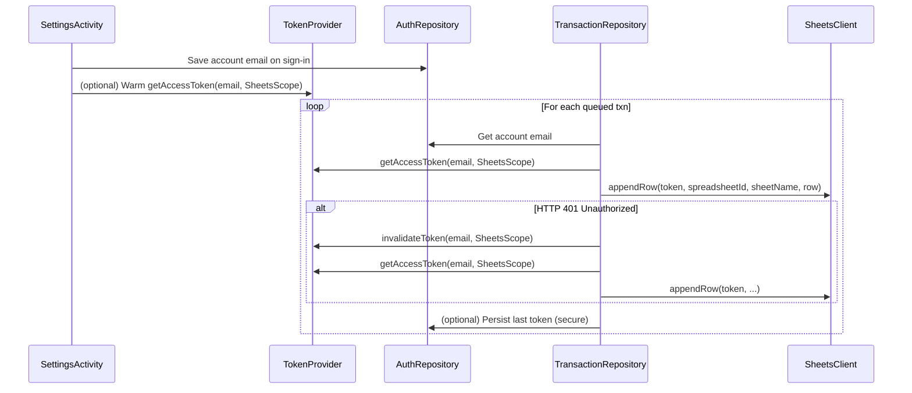

# Design Document

## Overview

Introduce a production-grade Google Identity OAuth flow and TokenProvider to obtain, cache, and invalidate Google Sheets API access tokens on Android. Wire it into TransactionRepository so sync uses a valid token, retries once on 401 by invalidating and refetching, and never crashes when auth is missing. Update Settings to reflect sign-in status, drive sign-in/out, and gate sync readiness.

## Steering Document Alignment

### Technical Standards (tech.md)
- Kotlin + Hilt DI: Provide TokenProvider and AuthRepository via Hilt.
- Security: EncryptedSharedPreferences for secrets; minimal scopes (Sheets only); no telemetry.
- Offline-first: Capture remains offline; tokens used only for network sync.
- WorkManager: Sync continues to run with retry policies and background resilience.

### Project Structure (structure.md)
- Place auth-related implementations under `app/src/main/java/com/voiceexpense/auth/`.
- Keep repository logic in `data/repository/`; do not leak Google APIs into UI.
- No cross-layer imports from UI to Data except via injected interfaces.

## Code Reuse Analysis

### Existing Components to Leverage
- AuthRepository: persists account email and token values in a secure store.
- TransactionRepository: posting/Sheets mapping + 401 retry scaffold already present.
- SettingsActivity: existing sign-in/out buttons and status labels.
- SheetsClient: appends rows to Sheets; no change needed.

### Integration Points
- TransactionRepository: replace current direct token reads with TokenProvider calls; keep AuthRepository for account identity and optional token caching.
- SettingsActivity: on sign-in success, store account email and optionally warm a token using TokenProvider.
- SyncWorker: no change to call site; repository handles token acquisition internally.

## Architecture

We add a concrete GoogleIdentityTokenProvider that talks to Google Identity/Play Services to acquire an OAuth2 access token for the Sheets scope. The provider exposes getAccessToken(accountEmail, scope) and invalidateToken(accountEmail, scope). It optionally caches the last token and its expiry in AuthRepository and/or memory. TransactionRepository uses the provider prior to each append call and handles 401 by invalidating and retrying once.

### Modular Design Principles
- Single File Responsibility: TokenProvider is auth-only; repository focuses on sync logic; SettingsActivity handles UX.
- Component Isolation: No Google APIs from TokenProvider leak into repository API.
- Service Layer Separation: UI → ViewModel/Activities invoke Settings and Work scheduling; Data layer does network.

## Components and Interfaces

### GoogleIdentityTokenProvider (new)
- Purpose: Acquire/refresh OAuth2 access tokens for Sheets scope using Google Identity on Android.
- Interfaces:
  - suspend fun getAccessToken(accountEmail: String, scope: String): String
  - suspend fun invalidateToken(accountEmail: String, scope: String)
- Dependencies: Android Context, AuthRepository (optional for caching), Google Play Services Auth.
- Reuses: AuthRepository secure storage for token caching (token, expiry).
- Notes:
  - Scope string: "https://www.googleapis.com/auth/spreadsheets" (wrapped per API needs).
  - Implementation options:
    - Using GoogleAuthUtil/AccountManager (classic OAuth2 token retrieval on Android) with scope prefix "oauth2:".
    - Or using GoogleAccountCredential from Google API Client libraries. We will prefer GoogleAuthUtil-based approach to keep Retrofit client and avoid adding the full API client stack.
  - Caching: store token + expiresAt; refresh when within 1 minute of expiry or when invalidated.

### TokenCache (in AuthRepository storage)
- Purpose: Persist short-lived access token metadata.
- Fields: token (String), expiresAtEpochMs (Long). Stored as a single JSON string in EncryptedSharedPreferences under KEY_ACCESS_TOKEN and KEY_ACCESS_TOKEN_EXPIRY.

### TransactionRepository (updated usage)
- Purpose: Obtain token via TokenProvider before posting; handle 401 with one invalidate+retry.
- Interfaces: unchanged.
- Dependencies: add TokenProvider; continue using AuthRepository for identity.
- Behavior changes:
  - Before appending, read account email from AuthRepository; if null/blank, treat as failure and skip posting.
  - Call tokenProvider.getAccessToken(email, SheetsScope).
  - On 401: tokenProvider.invalidateToken(email, SheetsScope); fetch again; retry once.

### SettingsActivity (small updates)
- Purpose: Drive sign-in/out and show status.
- Changes:
  - On sign-in success, save account email via AuthRepository and optionally warm token in background.
  - On sign-out, call AuthRepository.signOut() and optionally TokenProvider.invalidateToken for safety.
  - Update gating message immediately after sign-in/out.

## Data Models

### TokenCache (persisted)
- token: String
- expiresAtEpochMs: Long
- storage: EncryptedSharedPreferences keys `access_token` and `access_token_expiry` (or a compact JSON under `access_token` if we avoid new key).

## Error Handling

### Error Scenarios
1. No signed-in account
   - Handling: Repository returns SyncResult with failures; logs concise message; Settings shows "Sign in required".
   - User Impact: Queued transactions remain; user prompted to sign in.

2. Token acquisition fails (network/user cancels)
   - Handling: Do not crash; return failures; WorkManager backoff applies.
   - User Impact: Sync delayed; settings instruct to try again.

3. 401 Unauthorized on append
   - Handling: Invalidate and retry once with fresh token; if still 401, stop retrying and mark failure in SyncResult.
   - User Impact: Sync resumes when sign-in is fixed/retried.

4. TokenProvider API exceptions
   - Handling: Wrap in Result failures inside repository; never expose stacktraces to UI; no tokens in logs.

## Testing Strategy

### Unit Testing
- TokenProvider
  - FakeProvider returns configured tokens; verify repository retry path.
- TransactionRepository
  - 401 then success path triggers invalidate+retry exactly once; POSTED status set with SheetReference row parsing.
  - Missing account email causes skipped posting and safe failure count.

### Integration Testing
- SettingsActivity
  - Sign-in/out updates status text and gating message.
- SyncWorker
  - With FakeTokenProvider + FakeSheetsClient, verify queued → posted when token valid; failed remains queued when token invalid.

### End-to-End Testing
- Manual: Sign in on device, set spreadsheet config, create a draft, confirm, and observe row append to sheet; revoke access then test 401 retry behavior (should reprompt sign-in next time).
