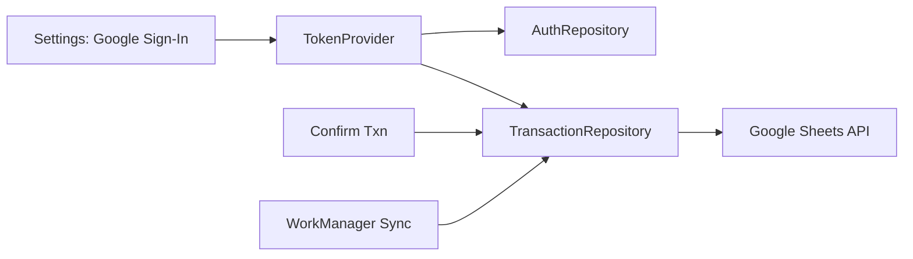

# Design Document

## Overview

This feature implements real Google Identity authentication and token lifecycle for Google Sheets posting. It wires a proper Sign-In with the Sheets scope, uses a concrete TokenProvider to fetch/refresh OAuth access tokens on demand, surfaces clear readiness gating in Settings, and enables robust sync via WorkManager + TransactionRepository with a 401-aware retry.

## Steering Document Alignment

### Technical Standards (tech.md)
- Uses Google Play Services Auth for OAuth and Retrofit/OkHttp for Sheets API.
- Keeps tokens in EncryptedSharedPreferences via existing AuthRepository facilities.
- Background sync via WorkManager, single retry on 401, exponential backoff policy.

### Project Structure (structure.md)
- Adds only to existing layers: auth (TokenProvider), UI (Settings), data (Repository), worker (Sync). No new modules.
- Follows naming and DI patterns in AppModule; reusable interfaces; test doubles for TokenProvider.

## Code Reuse Analysis

### Existing Components to Leverage
- AuthRepository: persists account email and token securely; used for sign-out and token invalidation.
- TokenProvider interface: single entry for token acquisition and invalidation.
- SettingsActivity: already owns Google Sign-In intent flow and UI; we will wire token warm-up and gating updates.
- TransactionRepository.syncPending(): already structured for a single 401-aware retry and SheetRef extraction.
- SheetsClient: Retrofit wrapper for append; unchanged.
- WorkScheduling.enqueueSyncNow / SyncWorker: triggers sync after confirm; reads sheet config from Settings.

### Integration Points
- SettingsActivity → TokenProvider: warm token after sign-in; invalidate on sign-out.
- SyncWorker/TransactionRepository → TokenProvider: get token for batch; invalidate+refresh on 401.
- Hilt AppModule: provide concrete TokenProvider that uses Google Identity.

## Architecture

- Google Sign-In drives account selection and consent for the Sheets scope.
- TokenProvider (GoogleIdentityTokenProvider) fetches an access token for a given account + scope using Google Play Services and caches it in AuthRepository; invalidate clears and forces a refresh.
- SettingsActivity persists account, warms token in background, and updates gating status.
- TransactionRepository uses the provider token per sync run, mapping queued transactions to rows and appending to Sheets; on 401, invalidates and retries once.

### Modular Design Principles
- Single responsibility: TokenProvider handles tokens; Settings handles UI; Repository handles sync logic; SheetsClient handles HTTP.
- Component isolation: no UI logic in repository, no token logic in worker.
- Service separation: OAuth acquisition is separate from posting; storage is abstracted by AuthRepository.

## Components and Interfaces

### GoogleIdentityTokenProvider (auth)
- Purpose: Acquire and invalidate OAuth access tokens for Sheets scope.
- Interfaces:
  - suspend fun getAccessToken(accountEmail: String, scope: String): String
  - suspend fun invalidateToken(accountEmail: String, scope: String)
- Dependencies: Context, AuthRepository, Google Play Services Auth.
- Reuses: AuthRepository for persistence; returns bearer token string.
- Implementation notes:
  - Use GoogleAuthUtil (or GoogleAccountCredential) to request token with scope string `"oauth2: https://www.googleapis.com/auth/spreadsheets"`.
  - Cache last token in AuthRepository (optional optimization); still re-fetch if empty or invalidated.
  - Invalidate via GoogleAuthUtil.clearToken(context, token).

### SettingsActivity updates (ui/common)
- Purpose: Drive sign-in/out UX, show signed-in status, and reflect sync readiness.
- Interfaces: Existing buttons and text fields; no new public APIs.
- Dependencies: AuthRepository, TokenProvider, GoogleSignInClient.
- Behavior:
  - On sign-in result: save account, warm token with TokenProvider, update auth status and gating.
  - On sign-out: GoogleSignIn.signOut, AuthRepository.signOut, TokenProvider.invalidate (best-effort), update UI state.
  - Gating: Shows three states: needs config, needs sign-in, ready.

### TransactionRepository (data/repository)
- Purpose: Sync queued transactions to Sheets using a valid token.
- Interfaces: suspend fun syncPending(): SyncResult
- Dependencies: TransactionDao, SheetsClient, AuthRepository, TokenProvider
- Behavior:
  - Fetch token once per batch (per run). On HTTP 401, invalidate+refresh once, then retry one append.
  - Map model to Sheet row exactly as specified; set POSTED + SheetReference on success.

### SyncWorker (worker)
- Purpose: Run sync under network constraints with backoff.
- Interfaces: doWork(): Result
- Behavior: Reads sheet config from Settings prefs; calls repo.syncPending(); returns success/retry accordingly.

## Data Models

- No new persistent models. Reuse Transaction and SheetReference.
- Settings prefs already define Spreadsheet ID and Sheet name keys.
- AuthRepository persists account email and cached token.

## Error Handling

### Error Scenarios
1. Token fetch failure (network/auth issue)
   - Handling: Show toast in Settings; do not enable ready state. Keep sync disabled until retried.
   - User Impact: Clear message; user can retry sign-in.

2. HTTP 401 from Sheets during sync
   - Handling: Invalidate token via TokenProvider, fetch new token, retry once for that transaction; if still failing, count as failed and rely on WorkManager retry.
   - User Impact: Silent; queued item remains until next retry.

3. Missing sheet config
   - Handling: Guard in worker/repo; throw/return retry; Settings shows gating message prompting config.
   - User Impact: Settings shows what’s missing; posting won’t proceed.

4. Sign-out during queued state
   - Handling: Clear tokens and account; upcoming sync runs detect missing auth and retry later after sign-in.
   - User Impact: Ready state removed; user must sign in again.

## Testing Strategy

### Unit Testing
- TransactionRepository: success path, 401 invalidation+refresh, failure path → queued remains.
- TokenProvider: fake implementation returns token and supports invalidate; verify repo behavior without Play Services.

### Integration Testing
- SyncWorker with FakeDao + FakeSheetsClient (success/401/failure) using in-memory AuthRepository and StaticTokenProvider.
- SettingsActivity gating text scenarios (no config, signed out, ready) via Robolectric.

### End-to-End Testing
- Manual: Sign in, set sheet, confirm a transaction, observe POSTED status and row appended.
- Sign-out and verify that posting is disabled until sign-in.
