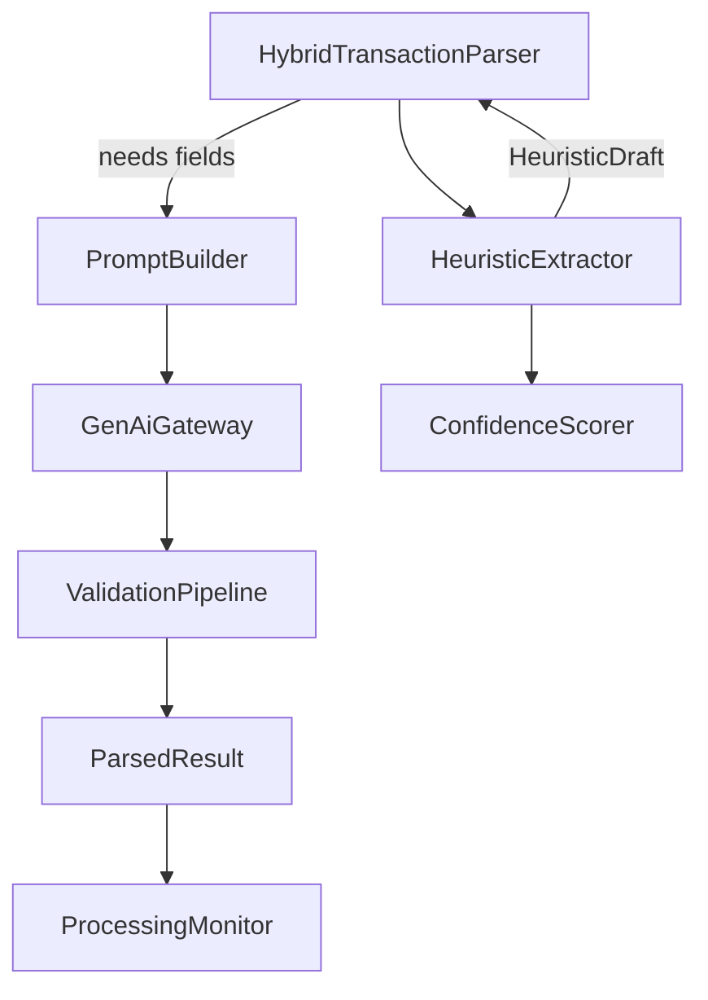

# Design Document

## Overview

We will refactor the hybrid parsing pipeline so that heuristic extraction runs first, generating a scored draft (`HeuristicDraft`) that fills fields like amount, date, merchant, Splitwise totals, account, and tags using deterministic rules. The LLM will only be invoked when required fields remain uncertain. Prompt construction will shrink, embedding known fields and compact example pairs drawn from real spreadsheet mappings. Validation and normalization will remain unchanged but will now merge heuristic and AI outputs, preserving heuristic confidence for UI hints. This design keeps on-device parsing fast for the Pixel 7a and reduces hallucinations while aligning with the Google Sheet schema defined in the steering docs.

## Steering Document Alignment

### Technical Standards (tech.md)
- Keeps all AI work on-device (MediaPipe Gemma 3 1B) per privacy requirement.
- Reuses existing MVVM/Repository layers; heuristics operate in Kotlin utilities with no new frameworks, matching the lightweight tooling approach.
- Leverages existing logging/monitoring hooks (`ProcessingMonitor`, `AiErrorHandler`) to record heuristic vs AI usage, supporting observability goals.

### Project Structure (structure.md)
- Places new heuristic utilities in `app/src/main/java/com/voiceexpense/ai/parsing/heuristic/` to keep AI-related code together, consistent with structure.md guidelines.
- Updates `HybridTransactionParser` (in `ai/parsing/hybrid/`) to orchestrate heuristics + LLM per existing hybrid architecture.
- Adds new unit tests in `app/src/test/java/com/voiceexpense/ai/parsing/heuristic/` and hybrid tests in `app/src/test/java/com/voiceexpense/ai/parsing/hybrid/`, matching testing layout described in structure.md.

## Code Reuse Analysis

### Existing Components to Leverage
- **`HybridTransactionParser`**: Extend to run heuristics first, reuse fallback logging/monitoring.
- **`ProcessingMonitor` & `ConfidenceScorer`**: Continue computing confidence, now factoring heuristic scores.
- **`PromptBuilder` & `FewShotExampleRepository`**: Refine to accept known fields, reuse example infrastructure but update content.
- **`StructuredOutputValidator` & `ValidationPipeline`**: Keep validation logic; only adjust to accept heuristic-filled defaults.

### Integration Points
- **MediaPipe GenAI client (`MediaPipeGenAiClient` via `GenAiGateway`)**: Only invoked when heuristics leave gaps.
- **Datastore/Repositories**: `ParsingContext` still provides allowed accounts/categories/tags lists consumed by heuristics and prompt builder.
- **UI/Confirmation Flow**: `ParsedResult` remains the output, but we will add confidence hints based on heuristic coverage.

## Architecture

Heuristic extraction becomes a dedicated component invoked before prompt building. The orchestrator merges heuristic and AI outputs and records provenance for UI and analytics.



### Modular Design Principles
- **Single File Responsibility**: `HeuristicExtractor` handles pattern matching only; `PromptBuilder` handles prompt text; `HybridTransactionParser` orchestrates flow.
- **Component Isolation**: Heuristics returns immutable data; no shared mutable state with AI layer.
- **Service Layer Separation**: Parsing pipeline still lives in AI layer; no persistence logic mixed in.
- **Utility Modularity**: Small helper functions (date parsing, amount detection, Splitwise detection) grouped inside the heuristic package.

## Components and Interfaces

### HeuristicExtractor
- **Purpose:** Parse utterances with deterministic rules, producing `HeuristicDraft` containing field values and confidence scores.
- **Interfaces:** `fun extract(input: String, context: ParsingContext): HeuristicDraft`
- **Dependencies:** `ParsingContext` for allowed accounts/categories, Kotlin regex utilities.
- **Reuses:** Basic merchant/account lookup logic currently embedded in `HybridTransactionParser` (will be moved here).

### HeuristicDraftMerger
- **Purpose:** Combine heuristic results with AI JSON, prioritizing heuristic fields when confidence ≥ threshold, otherwise using AI.
- **Interfaces:** `fun merge(heuristic: HeuristicDraft, ai: ParsedResult?): ParsedResult`
- **Dependencies:** `StructuredOutputValidator` for sanitation.
- **Reuses:** Existing mapping and validator modules.

### PromptBuilder (refined)
- **Purpose:** Build compact prompt strings using real sample pairs and embed known field JSON with `null` for missing fields.
- **Interfaces:** `fun build(input: String, context: ParsingContext, known: HeuristicDraft): String`
- **Dependencies:** Updated example repository, `SchemaTemplates` for concise schema text.
- **Reuses:** Current system instruction, logging, and context hints (condensed).

## Data Models

### HeuristicDraft
```
data class HeuristicDraft(
    val fields: Map<FieldKey, FieldValue>,
    val confidence: Map<FieldKey, Float>,
    val coverageScore: Float,
    val requiresAi: Boolean
)
```
- `FieldKey` enumerates transaction fields (amountUsd, userLocalDate, type, etc.).
- `FieldValue` wraps typed values (BigDecimal, LocalDate, String, List<String>).
- `coverageScore` = aggregate confidence (0..1).
- `requiresAi` true if any mandatory field confidence < threshold.

### FieldConfidenceThresholds
```
data class FieldConfidenceThresholds(
    val mandatory: Map<FieldKey, Float> = defaultMandatoryThresholds,
    val optional: Map<FieldKey, Float> = defaultOptionalThresholds
)
```
- Configurable thresholds (e.g., amount 0.9, date 0.8, merchant 0.7) to determine LLM invocation.

## Error Handling

### Heuristic extraction failure
1. **Scenario:** Regex parsing throws (malformed input).  
   - **Handling:** Catch and return empty draft with `requiresAi=true`.  
   - **User Impact:** Pipeline falls back to AI; user sees normal flow.

2. **Scenario:** Splitwise inference yields `amountUsd > splitOverallChargedUsd`.  
   - **Handling:** Clamp to `overall`, flag heuristic confidence low, let validation detect if AI returns inconsistent values.  
   - **User Impact:** Confirmation screen marks low confidence for amount field.

### AI failure after heuristics
1. **Scenario:** MediaPipe not available or returns blank.  
   - **Handling:** Return heuristic draft only, mark confidence low, log via `ProcessingMonitor`.  
   - **User Impact:** Some fields empty; UI shows more editable blanks but still usable.

2. **Scenario:** Validation rejects AI output twice.  
   - **Handling:** Emit heuristic result with error list.  
   - **User Impact:** Confirmation screen indicates low confidence, user edits manually.

## Testing Strategy

### Unit Testing
- `HeuristicExtractorTest`: cover date parsing, amount/overall pairing, merchant/account matching, tag/category inference.
- `HeuristicDraftMergerTest`: ensure heuristic values persist when confidence high, AI fills gaps otherwise.
- `PromptBuilderTest`: verify known-field embedding, example selection, and token count limits.

### Integration Testing
- Extend `HybridTransactionParserTest`: scenarios where heuristics satisfy all fields (no AI call), partial fill requiring AI, AI failure fallback.
- Android instrumentation test to ensure prompt length and latency improvements (mock GenAI, measure call counts).

### End-to-End Testing
- Espresso test from input text through confirmation UI verifying auto-filled fields and confidence indicators for:  
  - Non-split expense  
  - Splitwise expense with overall amount  
  - Income deposit  
- Offline scenario ensuring heuristics alone still allow confirmation while AI unavailable.
