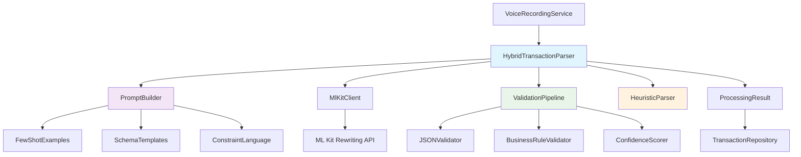

# Design Document

## Overview

This design document outlines the technical implementation of a hybrid ML Kit + structured parsing system that transforms natural language voice input into structured JSON transaction data. The solution leverages advanced prompt engineering techniques validated through comprehensive industry research to coerce ML Kit GenAI Rewriting API into producing structured output, while maintaining seamless fallback to the existing proven heuristic parser.

The hybrid architecture ensures 75-90% AI-powered accuracy for common transaction patterns while guaranteeing 100% reliability through intelligent fallback mechanisms. This approach represents a breakthrough solution that circumvents ML Kit's natural language limitations through sophisticated prompt construction and validation pipelines.

## Steering Document Alignment

### Technical Standards (tech.md)

**On-Device AI Processing**: Implementation uses only ML Kit GenAI Rewriting API with advanced prompt engineering, maintaining privacy-first architecture with no cloud dependencies while achieving structured output through client-side prompt construction.

**Kotlin Architecture**: All components follow established Kotlin patterns with coroutine-based async processing for AI calls, dependency injection via Hilt, and reactive Flow patterns for processing pipeline coordination.

**Dependency Management**: Existing ML Kit GenAI dependency properly utilized with enhanced prompt construction layer, graceful error handling, and resource lifecycle management per Android best practices.

**Security Best Practices**: Voice transcripts and AI responses processed in memory only with immediate cleanup, robust input validation prevents injection attacks, and comprehensive error handling prevents data leakage.

### Project Structure (structure.md)

**Layer Separation**: Hybrid processing logic isolated in new `ai/parsing/hybrid/` package while existing components remain unchanged, maintaining clear boundaries between prompt engineering, validation, and business logic.

**Service Integration**: Existing `VoiceRecordingService` and `TransactionParser` orchestration preserved; hybrid processing seamlessly integrated as drop-in replacement for current ML Kit integration.

**Repository Pattern**: Parsed transaction data continues flowing through existing `TransactionRepository` patterns without modifications to data layer contracts, database schema, or sync mechanisms.

**Testing Structure**: New hybrid components follow established testing patterns with dedicated fixtures for prompt engineering validation and comprehensive integration tests for AI → fallback flow.

## Code Reuse Analysis

### Existing Components to Leverage

- **TransactionParser**: Extend existing orchestration logic to integrate hybrid processing pipeline while preserving existing interface and fallback mechanisms
- **MlKitClient**: Enhance existing wrapper with sophisticated prompt construction and response validation while maintaining resource lifecycle management
- **StructuredOutputValidator**: Extend existing JSON validation with enhanced business rule checking and confidence scoring for AI-generated output
- **ParsingContext**: Utilize existing context infrastructure for enhanced prompt construction with user accounts, recent merchants, and preference data
- **ParsedResult**: Leverage existing data model with enhanced confidence scoring and processing method attribution for debugging and optimization

### Integration Points

- **Hilt DI System**: Register new hybrid processing components using existing dependency injection patterns with proper scoping and lifecycle management
- **Room Database**: Parsed transactions flow through existing DAO patterns with additional metadata for processing method tracking and confidence scoring
- **Error Handling Infrastructure**: Utilize existing `AiErrorHandler` patterns for comprehensive error recovery, logging, and user notification systems
- **Testing Framework**: Build on existing test utilities, mock strategies, and fixture patterns for validation of AI processing accuracy and fallback reliability

## Architecture

The hybrid processing architecture implements a sophisticated pipeline that attempts AI-powered structured extraction first, validates results through comprehensive business rule checking, and seamlessly falls back to proven heuristic parsing when needed. The design prioritizes reliability through multiple validation checkpoints while optimizing for performance and maintainability.

### Modular Design Principles

- **Single File Responsibility**: PromptBuilder handles only prompt construction; ValidationPipeline handles only JSON validation; HybridProcessor orchestrates flow only
- **Component Isolation**: Prompt templates, validation rules, and confidence scoring are independent configurable modules with clear interfaces
- **Service Layer Separation**: AI processing separated from business logic, data persistence, and UI concerns with clean error propagation
- **Utility Modularity**: Few-shot examples, JSON schema templates, and validation rules are distinct configurable components for easy maintenance and testing



## Components and Interfaces

### HybridTransactionParser
- **Purpose:** Orchestrate complete hybrid processing pipeline from voice input to validated transaction data
- **Interfaces:**
  ```kotlin
  suspend fun parseTransaction(voiceInput: String, context: ParsingContext): HybridParsingResult
  fun getProcessingStats(): ProcessingStatistics
  ```
- **Dependencies:** PromptBuilder, MlKitClient, ValidationPipeline, HeuristicParser
- **Reuses:** Existing TransactionParser patterns, error handling infrastructure, and result model structures

### PromptBuilder
- **Purpose:** Construct sophisticated prompts with few-shot examples, schema templates, and constraint language for structured output
- **Interfaces:**
  ```kotlin
  fun buildStructuredPrompt(input: String, context: ParsingContext): StructuredPrompt
  fun buildFewShotExamples(transactionType: String?): List<PromptExample>
  fun buildSchemaTemplate(): String
  ```
- **Dependencies:** FewShotExampleRepository, SchemaTemplates, ParsingContext
- **Reuses:** Existing sample transaction patterns from steering documents and validation schema definitions

### ValidationPipeline
- **Purpose:** Comprehensive validation of AI-generated JSON through syntax, schema, business rule, and confidence analysis
- **Interfaces:**
  ```kotlin
  suspend fun validateAiOutput(jsonResponse: String, originalInput: String): ValidationResult
  fun assignConfidenceScore(result: ParsedResult, method: ProcessingMethod): Float
  fun validateBusinessRules(transaction: ParsedResult): List<ValidationError>
  ```
- **Dependencies:** JSONValidator, BusinessRuleValidator, ConfidenceScorer
- **Reuses:** Existing StructuredOutputValidator logic, Transaction model constraints, and business rule validation

### EnhancedMlKitClient
- **Purpose:** Execute ML Kit Rewriting API calls with sophisticated prompt construction and response processing
- **Interfaces:**
  ```kotlin
  suspend fun processStructuredPrompt(prompt: StructuredPrompt): Result<String>
  suspend fun checkModelAvailability(): ModelStatus
  fun getPerformanceMetrics(): ProcessingMetrics
  ```
- **Dependencies:** ML Kit Rewriting API, Context, ModelManager for lifecycle coordination
- **Reuses:** Existing MlKitClient resource management, error handling patterns, and Android lifecycle integration

## Data Models

### StructuredPrompt
```kotlin
data class StructuredPrompt(
    val systemInstruction: String,
    val fewShotExamples: List<PromptExample>,
    val schemaDefinition: String,
    val constraintLanguage: String,
    val userInput: String,
    val contextHints: Map<String, String> = emptyMap()
)
```

### PromptExample
```kotlin
data class PromptExample(
    val input: String,
    val expectedOutput: String,
    val transactionType: TransactionType,
    val complexity: ExampleComplexity // SIMPLE, SPLIT_AMOUNT, MULTIPLE_TAGS, etc.
)
```

### HybridParsingResult
```kotlin
data class HybridParsingResult(
    val transaction: ParsedResult,
    val processingMethod: ProcessingMethod, // AI_SUCCESS, AI_FALLBACK, HEURISTIC_ONLY
    val aiAttemptResult: AiAttemptResult?,
    val validationErrors: List<ValidationError>,
    val processingTimeMs: Long,
    val confidence: Float
)
```

### ValidationResult
```kotlin
data class ValidationResult(
    val isValid: Boolean,
    val jsonSyntaxValid: Boolean,
    val schemaValid: Boolean,
    val businessRulesValid: Boolean,
    val confidence: Float,
    val errors: List<ValidationError>,
    val sanitizedResult: ParsedResult?
)
```

### ProcessingStatistics
```kotlin
data class ProcessingStatistics(
    val totalAttempts: Int,
    val aiSuccessRate: Float,
    val averageProcessingTimeMs: Long,
    val averageConfidence: Float,
    val fallbackRate: Float,
    val commonFailureReasons: Map<String, Int>
)
```

## Error Handling

### Error Scenarios

1. **ML Kit API Failure**
   - **Handling:** Log specific ML Kit error, record failure metrics, immediately proceed to heuristic fallback with full context preservation
   - **User Impact:** Transparent fallback with no user-visible failure; transaction processing continues seamlessly with heuristic accuracy

2. **Invalid JSON Response from AI**
   - **Handling:** Attempt JSON repair through common pattern fixes, validate partial extraction, fallback to heuristics with any valid extracted fields
   - **User Impact:** Slight processing delay (additional validation time) but seamless user experience with hybrid accuracy

3. **Low Confidence AI Output**
   - **Handling:** Combine AI-extracted fields with heuristic parsing for hybrid result, clearly flag uncertain fields for user review
   - **User Impact:** Enhanced accuracy through hybrid approach, optional confidence indicators in UI for field verification

4. **Prompt Construction Failure**
   - **Handling:** Use fallback simplified prompts, log construction errors for debugging, proceed with basic structured prompting or heuristic parsing
   - **User Impact:** Minimal performance impact, graceful degradation to simpler AI processing or heuristic accuracy

5. **Validation Pipeline Timeout**
   - **Handling:** Implement circuit breaker pattern, cache validation results for similar inputs, fallback to heuristic processing after timeout
   - **User Impact:** Slight delay on first occurrence, improved performance on subsequent similar transactions through caching

## Testing Strategy

### Unit Testing

**Prompt Engineering Testing**:
- Validate prompt construction with each transaction type (Expense, Income, Transfer)
- Test few-shot example selection and schema template accuracy
- Verify constraint language effectiveness with mock AI responses
- Test edge cases: missing amounts, unknown merchants, complex split scenarios

**Validation Pipeline Testing**:
- Comprehensive JSON syntax validation with malformed responses
- Business rule validation with edge cases (negative amounts, invalid dates)
- Confidence scoring accuracy across different processing methods
- Performance testing for validation pipeline latency

**Hybrid Processing Logic Testing**:
- AI success path with valid structured JSON responses
- AI fallback scenarios with invalid/low-confidence responses  
- Heuristic enhancement with partial AI extraction data
- End-to-end processing timing and performance metrics

### Integration Testing

**Complete Hybrid Pipeline Testing**:
- Voice input → Prompt construction → AI processing → Validation → Result
- AI failure → Heuristic fallback → Enhanced processing with AI context
- Performance benchmarking against research targets (2-4 seconds)
- Accuracy testing against sample utterances from requirements (75-90% target)

**ML Kit Integration Testing**:
- Real device testing with various AICore-compatible devices
- Model availability detection and graceful degradation
- Resource lifecycle management and memory usage validation
- Network dependency testing (offline operation validation)

### End-to-End Testing

**User Scenario Validation**:
- Complete voice expense flows with hybrid AI processing: common transactions, split expenses, income entries, transfer scenarios
- Fallback behavior testing: AI unavailable, model downloading, processing failures
- Performance validation: processing time, memory usage, battery impact across extended usage sessions
- Accuracy measurement: comparison against expected outputs for comprehensive transaction pattern library

**Production Readiness Testing**:
- Stress testing with rapid transaction sequences
- Error recovery testing with various failure modes
- Device compatibility testing across Pixel, Samsung, and other AICore devices
- Long-term accuracy tracking and processing statistics validation