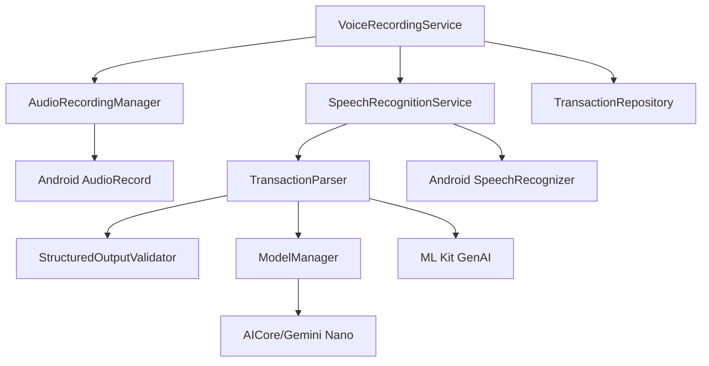

# Design Document

## Overview

This design document outlines the technical implementation for integrating ML Kit GenAI APIs (Gemini Nano) and Android SpeechRecognizer API into the Voice Expense Tracker app. The implementation replaces placeholder AI components with production-ready on-device processing that transforms voice input into structured financial transaction data.

The design maintains the existing architecture while enhancing two critical components: `SpeechRecognitionService` for audio transcription and `TransactionParser` for natural language understanding. Both components will operate entirely on-device to preserve privacy and enable offline functionality.

## Steering Document Alignment

### Technical Standards (tech.md)

**On-Device AI Processing**: Implementation uses only Android's built-in SpeechRecognizer and ML Kit GenAI APIs, with no cloud AI calls, aligning with privacy-first constraints.

**Kotlin Architecture**: All components follow established Kotlin patterns with proper coroutines usage, dependency injection via Hilt, and reactive programming with Flow/StateFlow.

**Dependency Management**: ML Kit dependencies are properly declared in build.gradle.kts, with graceful degradation when models are unavailable on device.

**Security Best Practices**: Audio data and transcripts are processed in memory only, with no persistent storage of sensitive voice data.

### Project Structure (structure.md)

**Layer Separation**: AI components remain isolated in the `ai/` package with clear boundaries between speech recognition (`ai/speech/`) and parsing (`ai/parsing/`) modules.

**Service Integration**: `VoiceRecordingService` orchestrates the AI pipeline while maintaining its existing responsibilities for lifecycle management and UI coordination.

**Repository Pattern**: Parsed transaction data flows through existing `TransactionRepository` patterns without modifications to data layer contracts.

**Testing Structure**: New AI components follow established testing patterns with fixtures in `test/java/com/voiceexpense/ai/` matching existing test organization.

## Code Reuse Analysis

### Existing Components to Leverage

- **VoiceRecordingService**: Extend existing service to coordinate real AI pipeline instead of placeholder methods
- **TransactionRepository**: Use existing data persistence and sync mechanisms without modification
- **Transaction Model**: Leverage existing data classes with all required fields already defined
- **ParsingContext**: Extend existing context class with additional ASR configuration parameters
- **ParsedResult**: Use existing result model that already matches steering document schema

### Integration Points

- **Hilt DI System**: Register new AI components using existing dependency injection patterns
- **Room Database**: Parsed transactions flow through existing DAO patterns with no schema changes required  
- **WorkManager Sync**: Background sync pipeline remains unchanged, processes confirmed transactions as before
- **UI ViewModels**: Existing ConfirmationViewModel can consume parsed results without modification

## Architecture

The ML Kit integration follows a pipeline architecture with clear separation between audio processing and text analysis. Each component handles a single concern while maintaining compatibility with existing service orchestration.

### Modular Design Principles

- **Single File Responsibility**: `SpeechRecognitionService` handles only ASR, `TransactionParser` handles only NLU
- **Component Isolation**: AI models are managed separately from business logic, with clear lifecycle boundaries
- **Service Layer Separation**: Audio capture, transcription, and parsing are distinct services with defined interfaces
- **Utility Modularity**: Model management, prompt engineering, and validation are separate utility classes



## Components and Interfaces

### SpeechRecognitionService
- **Purpose:** Convert audio input to text using Android's on-device speech recognition
- **Interfaces:** 
  ```kotlin
  suspend fun startListening(config: RecognitionConfig): Flow<RecognitionResult>
  fun stopListening()
  suspend fun isAvailable(): Boolean
  ```
- **Dependencies:** Android SpeechRecognizer API, AudioRecordingManager for audio capture
- **Reuses:** Existing ParsingContext for language/locale configuration

### TransactionParser  
- **Purpose:** Parse transcribed text into structured transaction data using ML Kit GenAI
- **Interfaces:**
  ```kotlin
  suspend fun parse(text: String, context: ParsingContext): ParsedResult
  suspend fun validateStructuredOutput(json: String): ValidationResult
  ```
- **Dependencies:** ML Kit GenAI APIs, ModelManager for Gemini Nano lifecycle
- **Reuses:** Existing ParsedResult model, ParsingContext configuration

### ModelManager
- **Purpose:** Manage ML Kit GenAI model lifecycle, downloads, and availability
- **Interfaces:**
  ```kotlin
  suspend fun ensureModelAvailable(): ModelStatus
  suspend fun getModelInfo(): ModelInfo
  fun isModelReady(): Boolean
  ```
- **Dependencies:** ML Kit AICore APIs for Gemini Nano management
- **Reuses:** Existing error handling patterns from other service components

### StructuredOutputValidator
- **Purpose:** Validate and sanitize JSON output from GenAI parsing to ensure schema compliance
- **Interfaces:**
  ```kotlin
  fun validateTransactionJson(json: String): ValidationResult
  fun sanitizeAmounts(parsed: ParsedResult): ParsedResult
  ```
- **Dependencies:** JSON parsing libraries, existing Transaction model schema
- **Reuses:** Existing Transaction validation logic and business rules

## Data Models

### RecognitionConfig
```kotlin
data class RecognitionConfig(
    val languageCode: String = "en-US",
    val maxResults: Int = 1,
    val partialResults: Boolean = false,
    val offlineMode: Boolean = true,
    val confidenceThreshold: Float = 0.5f
)
```

### RecognitionResult
```kotlin
sealed class RecognitionResult {
    data class Success(val text: String, val confidence: Float) : RecognitionResult()
    data class Partial(val text: String) : RecognitionResult() 
    data class Error(val error: RecognitionError) : RecognitionResult()
    object Listening : RecognitionResult()
    object Complete : RecognitionResult()
}
```

### ModelStatus
```kotlin
sealed class ModelStatus {
    object Ready : ModelStatus()
    object Downloading : ModelStatus() 
    data class Unavailable(val reason: String) : ModelStatus()
    data class Error(val throwable: Throwable) : ModelStatus()
}
```

### ValidationResult
```kotlin
data class ValidationResult(
    val isValid: Boolean,
    val errors: List<String> = emptyList(),
    val warnings: List<String> = emptyList(),
    val sanitizedResult: ParsedResult? = null
)
```

## Error Handling

### Error Scenarios

1. **Speech Recognition Failure**
   - **Handling:** Retry up to 3 times with exponential backoff, then offer manual text input
   - **User Impact:** Toast notification with retry button, fallback to keyboard input

2. **ML Kit Model Unavailable**
   - **Handling:** Check model status, attempt download if network available, graceful degradation
   - **User Impact:** Progress dialog during model download, clear error message if download fails

3. **Parsing Low Confidence**
   - **Handling:** Flag uncertain fields for user verification, provide voice correction interface
   - **User Impact:** Highlighted fields in confirmation UI with option to re-voice corrections

4. **Network Unavailable During Model Download**
   - **Handling:** Queue model download for later, use simplified parsing rules as fallback
   - **User Impact:** Notification about reduced accuracy, option to retry when online

5. **Invalid JSON from GenAI**
   - **Handling:** Validate output schema, sanitize malformed data, retry with simplified prompt
   - **User Impact:** Transparent to user, may see lower confidence scores for affected fields

## Testing Strategy

### Unit Testing

**SpeechRecognitionService Testing**:
- Mock Android SpeechRecognizer with fake recognition results
- Test error scenarios: no microphone permission, recognition timeout, audio hardware failures
- Validate configuration parameter handling and Flow emissions

**TransactionParser Testing**:
- Use the 5 sample utterances from steering docs as test fixtures
- Mock ML Kit GenAI API responses with deterministic JSON outputs  
- Test edge cases: ambiguous amounts, unknown merchants, malformed tags
- Validate confidence scoring and error recovery paths

**ModelManager Testing**:
- Mock AICore APIs for model download simulation
- Test offline scenarios and graceful degradation
- Validate model lifecycle state transitions

### Integration Testing

**End-to-End AI Pipeline**:
- Widget tap → Service start → ASR → Parsing → Repository save
- Test with real audio samples covering expense/income/transfer types
- Validate data flow from voice input to confirmed transaction

**Service Integration**:
- VoiceRecordingService orchestration of ASR and parsing components
- Error propagation between service layers
- Proper cleanup and resource management

### End-to-End Testing

**User Scenarios**:
- Complete voice expense flow: "I spent $23 at Starbucks for coffee"
- Split expense scenario: "Dinner at La Fiesta thirty dollars, my share twenty"  
- Income transaction: "Paycheck two thousand, tag July"
- Error recovery: Background noise → retry → manual fallback

**Device Compatibility**:
- Test on Google Pixel devices with different Android versions
- Verify ML Kit model availability across supported hardware
- Performance testing for <3 second parsing latency requirement