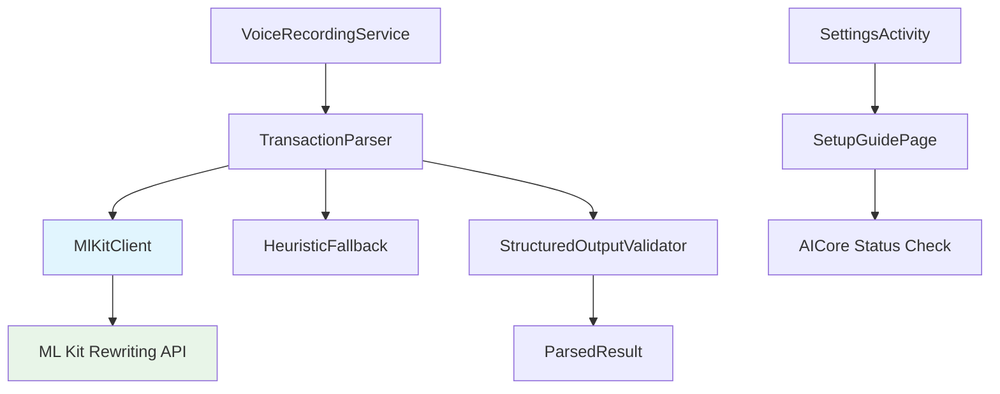

# Design Document

## Overview

This design document outlines the technical implementation for integrating production-ready ML Kit GenAI APIs into the Voice Expense Tracker app, replacing the current placeholder implementation in `TransactionParser.runGenAi()`. The design focuses on a clean, simple integration that assumes users have pre-configured AICore and Gemini Nano on their devices, while providing helpful setup guidance for those who haven't.

The implementation leverages ML Kit's GenAI Rewriting API to transform natural language voice input into structured JSON transaction data, maintaining the existing architecture and fallback mechanisms while dramatically improving parsing accuracy from basic heuristics to production-grade AI processing.

## Steering Document Alignment

### Technical Standards (tech.md)

**On-Device AI Processing**: Implementation uses only ML Kit GenAI Rewriting API with no cloud AI calls, maintaining privacy-first architecture while leveraging Google's production Gemini Nano model.

**Kotlin Architecture**: All components follow established Kotlin patterns with proper coroutines usage for async AI calls, dependency injection via Hilt, and reactive programming with Flow for streaming results.

**Dependency Management**: ML Kit GenAI dependency properly declared in build.gradle.kts with version constraints and graceful handling when API is unavailable.

**Security Best Practices**: Voice transcripts processed in memory only with immediate cleanup, no persistent storage of sensitive voice data, leveraging Android's secure AICore service.

### Project Structure (structure.md)

**Layer Separation**: AI integration remains isolated in existing `ai/parsing/` package with clear boundaries maintained between parsing logic and service orchestration.

**Service Integration**: `VoiceRecordingService` continues orchestrating the pipeline with minimal changes, `TransactionParser` enhanced but interface unchanged.

**Repository Pattern**: Parsed transaction data flows through existing `TransactionRepository` patterns without modifications to data layer contracts or database schema.

**Testing Structure**: New AI integration tests follow established patterns in `test/java/com/voiceexpense/ai/` with mock strategies matching existing test organization.

## Code Reuse Analysis

### Existing Components to Leverage

- **TransactionParser**: Extend existing class, replace placeholder `runGenAi()` with real ML Kit integration, maintain existing interface and fallback logic
- **ParsedResult**: Use existing data class without modifications - already matches required JSON schema perfectly
- **ParsingContext**: Leverage existing context with user settings (accounts, recent merchants) for enhanced prompt context
- **StructuredOutputValidator**: Extend existing validator to handle ML Kit JSON responses with same sanitization logic
- **VoiceRecordingService**: Minimal changes needed - existing orchestration and error handling patterns work perfectly

### Integration Points

- **Hilt DI System**: Register ML Kit components using existing dependency injection patterns in `AiModule`
- **Room Database**: Parsed transactions flow through existing DAO patterns with no schema changes required
- **Settings Activity**: Extend existing settings to include AI setup status and help page link
- **Error Handling**: Use existing error propagation patterns from `AiErrorHandler` to UI layers

## Architecture

The ML Kit integration follows a clean adapter pattern that slots into the existing AI pipeline without disrupting established service orchestration or data flow. The core principle is "enhance, don't replace" - keeping all existing logic while adding production-grade AI capabilities on top.

### Modular Design Principles

- **Single File Responsibility**: `TransactionParser` handles only text-to-JSON conversion, `MlKitClient` handles only API interactions
- **Component Isolation**: ML Kit wrapper isolated from business logic, allowing easy testing and future API changes
- **Service Layer Separation**: AI processing remains separate from UI concerns, data persistence, and service lifecycle management
- **Utility Modularity**: Prompt engineering, JSON validation, and error mapping are distinct, focused utilities



## Components and Interfaces

### MlKitClient
- **Purpose:** Wrapper around ML Kit GenAI Rewriting API for structured text transformation
- **Interfaces:** 
  ```kotlin
  suspend fun transformToJson(text: String, context: ParsingContext): String?
  suspend fun checkAvailability(): Boolean
  fun close()
  ```
- **Dependencies:** ML Kit GenAI Rewriting API, Android Context for client initialization
- **Reuses:** Existing error handling patterns, coroutine integration from existing AI components

### Enhanced TransactionParser
- **Purpose:** Orchestrate ML Kit processing with fallback to existing heuristic logic
- **Interfaces:** 
  ```kotlin
  suspend fun parse(text: String, context: ParsingContext): ParsedResult
  ```
- **Dependencies:** MlKitClient, existing StructuredOutputValidator, ModelManager for status checks
- **Reuses:** Existing ParsedResult model, ParsingContext, validation logic, fallback heuristics

### SetupGuidePage
- **Purpose:** Guide users through AICore and Gemini Nano setup process
- **Interfaces:**
  ```kotlin
  fun displaySetupInstructions()
  suspend fun validateSetup(): SetupStatus
  fun showTroubleshooting(error: SetupError)
  ```
- **Dependencies:** ML Kit feature status APIs, Android WebView for documentation links
- **Reuses:** Existing Activity patterns, navigation flows, error display components

## Data Models

### RewritingPrompt
```kotlin
data class RewritingPrompt(
    val systemPrompt: String,
    val userText: String, 
    val context: Map<String, Any> = emptyMap(),
    val outputFormat: String = "JSON"
)
```

### SetupStatus
```kotlin
sealed class SetupStatus {
    object Ready : SetupStatus()
    object NotConfigured : SetupStatus()  
    data class Error(val message: String, val troubleshooting: String) : SetupStatus()
}
```

### Enhanced ParsingContext
```kotlin
data class ParsingContext(
    val defaultDate: LocalDate = LocalDate.now(),
    val recentMerchants: List<String> = emptyList(),
    val knownAccounts: List<String> = emptyList(),
    // New fields for ML Kit integration
    val languageCode: String = "en-US",
    val userPreferences: Map<String, String> = emptyMap()
)
```

## Error Handling

### Error Scenarios

1. **ML Kit Service Unavailable**
   - **Handling:** Detect via feature status check, gracefully fall back to heuristic parser, log for debugging
   - **User Impact:** Transparent fallback with optional notification about reduced accuracy, link to setup help

2. **AICore Quota Exceeded**
   - **Handling:** Implement exponential backoff retry (1s, 2s, 4s), then fall back to heuristics after 3 attempts
   - **User Impact:** Brief "Processing..." indicator, then normal transaction flow with fallback parsing

3. **Device Incompatibility (Unlocked Bootloader)**
   - **Handling:** Detect at startup via API availability check, permanently disable ML Kit path
   - **User Impact:** One-time notification explaining limitation, app functions normally with heuristic parsing

4. **Invalid JSON Response from ML Kit**
   - **Handling:** Validate JSON schema, sanitize malformed fields, retry once with simplified prompt
   - **User Impact:** Transparent to user, may see lower confidence scores indicating uncertainty

5. **Network Issues During Setup Validation**
   - **Handling:** Cache last known good status, provide offline validation where possible
   - **User Impact:** Clear messaging about network requirements for initial setup, graceful degradation

## Testing Strategy

### Unit Testing

**MlKitClient Testing**:
- Mock ML Kit Rewriting API responses with deterministic JSON outputs
- Test error scenarios: service unavailable, quota exceeded, malformed responses  
- Validate prompt engineering with the 5 sample utterances from steering docs
- Test timeout handling and resource cleanup

**Enhanced TransactionParser Testing**:
- Test ML Kit success path vs fallback decision logic
- Verify existing test fixtures still pass with fallback path
- Test confidence scoring and error propagation to UI
- Validate integration between ML Kit results and existing validation logic

### Integration Testing

**End-to-End AI Pipeline**:
- Widget tap → Service → ASR → ML Kit parsing → Repository save
- Test with real device AI when available, mocked responses in CI
- Validate performance metrics: <3 second parsing latency requirement
- Test error recovery: ML Kit failure → heuristic fallback → successful save

**Settings Integration**:
- Setup guide navigation and validation flows
- AI status detection and help page integration
- User preference storage and retrieval for parsing context

### End-to-End Testing

**Production Scenarios**:
- Complete voice expense flow with Gemini Nano integration on supported devices
- Fallback behavior testing on devices without AI support
- Performance benchmarking: parsing accuracy comparison vs existing heuristics
- Battery and memory impact testing during extended usage sessions

**Setup and Onboarding**:
- New user setup guidance flow from installation to first successful AI parse
- Error recovery scenarios: failed setup → troubleshooting → successful retry
- Device compatibility detection and appropriate user messaging