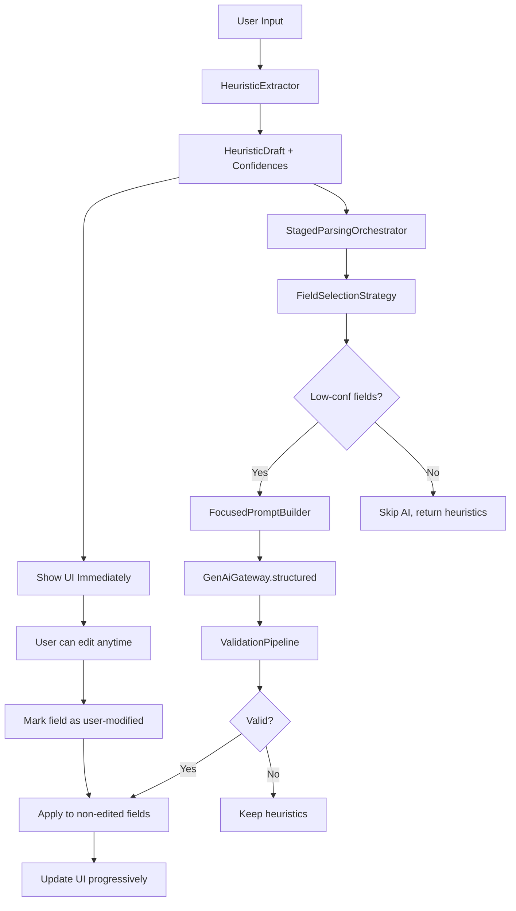

# Design Document

## Overview

This feature implements a **three-stage progressive parsing pipeline** to improve transaction parsing accuracy for the on-device Gemma 3 1B model. The design splits parsing into:

1. **Stage 1: Instant Heuristics** - Deterministic extraction runs immediately (<100ms) and displays results
2. **Stage 2: Focused AI Refinement** - Single async AI call targets only low-confidence fields with minimal prompts
3. **Stage 3: Progressive UI Updates** - Fields update asynchronously as AI results arrive

**Key Design Principles:**
- **Non-blocking**: UI displays heuristic results immediately while AI runs in background
- **Focused prompting**: AI only refines 2-4 fields instead of all 11 fields
- **User-first**: Manual edits always take precedence over AI updates
- **Backward compatible**: Maintains existing HybridParsingResult interface

**Current System:**
```
Input → HeuristicExtractor → Build full prompt → GenAI (all fields) → Merge → Result (2-3s)
```

**New System:**
```
Input → HeuristicExtractor → Show UI (<100ms) → Identify low-conf fields →
  Build focused prompt → GenAI (2-4 fields) → Progressive updates (1-2s async)
```

## Steering Document Alignment

### Technical Standards (tech.md)

**Hybrid Processing Architecture (tech.md lines 117-122):**
- Implements the documented "Field-by-Field Parsing (Fallback)" strategy as the primary approach
- Maintains "AI-First Path" with "Heuristic Fallback" for reliability
- Uses existing "Confidence Scoring" to evaluate parsing quality

**Prompting Strategy for Smaller Models (tech.md lines 95-116):**
- Moves from "Single-Shot Parsing (Primary)" to "Field-by-Field Parsing (Fallback)"
- Reduces prompt size from 1700→1000 chars as documented
- Uses template-based parsing for 1-2 field refinements

**Form Interface Technology (tech.md lines 123-142):**
- Leverages StateFlow for progressive field updates
- Uses existing validation patterns with visual feedback
- Maintains progressive disclosure patterns

**Performance Requirements (tech.md lines 144-151):**
- Targets <100ms for Stage 1 (heuristic display)
- Targets <2s total latency (improvement from current 2-3s)
- Maintains <3s median parsing latency requirement

### Project Structure (structure.md)

**AI Processing Structure (structure.md lines 270-304):**
- New components go in `ai/parsing/hybrid/` alongside existing hybrid processing
- Follows separation pattern: parsing orchestration, prompt building, model interface
- Maintains clear error boundaries between parsing failures and UI updates

**Code Organization Principles (structure.md lines 212-221):**
- **Single Responsibility**: `StagedParsingOrchestrator` handles flow, `FocusedPromptBuilder` builds prompts
- **Layer Separation**: Clear boundaries between parsing logic and UI state management
- **Reactive Patterns**: Uses StateFlow for progressive field updates
- **Error Handling**: Result/Either pattern for AI refinement outcomes

**Code Size Guidelines (structure.md lines 248-268):**
- Target: `StagedParsingOrchestrator` <300 lines
- Target: `FocusedPromptBuilder` <200 lines
- Target: `FieldRefinementTracker` <150 lines
- Maximum cyclomatic complexity: 10 per method

## Code Reuse Analysis

### Existing Components to Leverage

- **HeuristicExtractor** (`ai/parsing/heuristic/HeuristicExtractor.kt`): Used as-is for Stage 1
  - `extract()` method returns `HeuristicDraft` with per-field confidence scores
  - `requiresAi()` logic determines if AI refinement is needed

- **HeuristicDraft** (`ai/parsing/heuristic/HeuristicDraft.kt`): Data model for heuristic results
  - `confidence(FieldKey)` method provides per-field confidence scores
  - `FieldConfidenceThresholds.DEFAULT` defines thresholds (e.g., amount=0.8, merchant=0.6)

- **GenAiGateway** (`ai/parsing/hybrid/GenAiGateway.kt`): Interface for AI calls
  - `isAvailable()` checks model readiness
  - `structured(prompt)` returns `Result<String>` for async handling

- **ValidationPipeline** (`ai/parsing/hybrid/ValidationPipeline.kt`): JSON validation
  - `validateRawResponse()` ensures AI output is valid JSON
  - Used to validate focused refinement responses

- **ConfidenceScorer** (`ai/parsing/hybrid/ConfidenceScorer.kt`): Quality assessment
  - `score(method, validated, result)` computes final confidence
  - Reused for scoring after AI refinement

- **ConfirmationViewModel** (`ui/confirmation/ConfirmationViewModel.kt`): UI state management
  - **Extension needed**: Add per-field loading states and progressive update handling
  - Already uses StateFlow pattern suitable for async updates

### Integration Points

- **HybridTransactionParser** (`ai/parsing/hybrid/HybridTransactionParser.kt`):
  - Orchestrates parsing flow; will invoke `StagedParsingOrchestrator` for staged mode
  - Returns `HybridParsingResult` to maintain interface contract
  - Configuration flag determines single-call vs staged approach

- **TransactionParser** (`ai/parsing/TransactionParser.kt`):
  - Top-level parser interface; no changes needed
  - Calls `HybridTransactionParser.parse()` which internally routes to staged logic

- **ConfirmationViewModel** (`ui/confirmation/ConfirmationViewModel.kt`):
  - Receives `Transaction` with heuristic results immediately
  - Observes `FieldRefinementState` flow for progressive updates
  - Applies updates only to non-user-modified fields

- **Database/Storage**:
  - No schema changes; uses existing `Transaction` model
  - Confidence scores stored as before in `transaction.confidence` field

## Architecture

### Modular Design Principles

- **Single File Responsibility**: Each component handles one stage or concern
  - `StagedParsingOrchestrator`: Coordinates three-stage flow
  - `FocusedPromptBuilder`: Builds minimal prompts for low-confidence fields
  - `FieldRefinementTracker`: Tracks per-field refinement state

- **Component Isolation**: New components are self-contained
  - `FocusedPromptBuilder` can be tested independently with mock field lists
  - `FieldRefinementTracker` manages state without coupling to UI

- **Service Layer Separation**: Clear layers maintained
  - Parsing layer: `StagedParsingOrchestrator`, `FocusedPromptBuilder`
  - State layer: `FieldRefinementTracker`, `FieldRefinementState`
  - UI layer: `ConfirmationViewModel` extensions for observing updates

- **Utility Modularity**: Focused, single-purpose utilities
  - `FieldSelectionStrategy`: Determines which fields need AI refinement
  - `PromptTemplates`: Template strings for focused prompts



## Components and Interfaces

### Component 1: StagedParsingOrchestrator

- **Purpose:** Coordinates the three-stage parsing flow: heuristics → field selection → focused AI → merge
- **Interfaces:**
  ```kotlin
  class StagedParsingOrchestrator(
      private val heuristicExtractor: HeuristicExtractor,
      private val genai: GenAiGateway,
      private val focusedPromptBuilder: FocusedPromptBuilder,
      private val thresholds: FieldConfidenceThresholds
  ) {
      suspend fun parseStaged(
          input: String,
          context: ParsingContext
      ): StagedParsingResult
  }

  data class StagedParsingResult(
      val heuristicDraft: HeuristicDraft,           // Stage 1 results
      val refinedFields: Map<FieldKey, Any?>,       // Stage 2 AI refinements
      val mergedResult: ParsedResult,                // Final merged result
      val fieldsRefined: Set<FieldKey>,              // Which fields were updated by AI
      val refinementErrors: List<String>             // Any errors during AI refinement
  )
  ```
- **Dependencies:** `HeuristicExtractor`, `GenAiGateway`, `FocusedPromptBuilder`, `ValidationPipeline`
- **Reuses:** `HeuristicExtractor.extract()`, `GenAiGateway.structured()`, `ValidationPipeline.validateRawResponse()`

### Component 2: FocusedPromptBuilder

- **Purpose:** Builds minimal prompts targeting only low-confidence fields
- **Interfaces:**
  ```kotlin
  class FocusedPromptBuilder {
      fun buildFocusedPrompt(
          input: String,
          heuristicDraft: HeuristicDraft,
          targetFields: Set<FieldKey>,
          context: ParsingContext
      ): String

      private fun buildTemplatePrompt(field: FieldKey, input: String, context: ParsingContext): String
      private fun buildMultiFieldPrompt(fields: Set<FieldKey>, input: String, heuristicDraft: HeuristicDraft): String
  }
  ```
- **Dependencies:** `ParsingContext`, `PromptTemplates`
- **Reuses:** Minimal context from `ParsingContext` (recent merchants/categories only if needed)

**Prompt Size Strategy:**
- **1-2 fields**: Use template-based single-field prompts (300-500 chars each)
  - Example: `"Given input 'Starbucks 5 dollars', what is the expense category? Options: Groceries, Dining, Transport, Personal"`
- **3+ fields**: Use minimal JSON schema with only target fields (800-1000 chars)
  - Example: `"Return JSON with only: merchant, expenseCategory, description. Input: [text]. Heuristics found: [amount, date, account]. Options: [categories]"`

### Component 3: FieldRefinementTracker

- **Purpose:** Tracks which fields are being refined, completed, or user-modified
- **Interfaces:**
  ```kotlin
  class FieldRefinementTracker {
      val refinementState: StateFlow<Map<FieldKey, FieldRefinementStatus>>

      fun markRefining(fields: Set<FieldKey>)
      fun markCompleted(field: FieldKey, value: Any?)
      fun markUserModified(field: FieldKey)
      fun isUserModified(field: FieldKey): Boolean
  }

  sealed class FieldRefinementStatus {
      object NotStarted : FieldRefinementStatus()
      object Refining : FieldRefinementStatus()
      data class Completed(val value: Any?) : FieldRefinementStatus()
      object UserModified : FieldRefinementStatus()
  }
  ```
- **Dependencies:** None (self-contained state manager)
- **Reuses:** StateFlow pattern from existing ViewModel architecture

### Component 4: FieldSelectionStrategy

- **Purpose:** Determines which fields need AI refinement based on confidence scores
- **Interfaces:**
  ```kotlin
  object FieldSelectionStrategy {
      fun selectFieldsForRefinement(
          heuristicDraft: HeuristicDraft,
          thresholds: FieldConfidenceThresholds
      ): Set<FieldKey>

      private val AI_REFINABLE_FIELDS = setOf(
          FieldKey.MERCHANT,
          FieldKey.DESCRIPTION,
          FieldKey.EXPENSE_CATEGORY,
          FieldKey.INCOME_CATEGORY,
          FieldKey.TAGS,
          FieldKey.NOTE
      )
  }
  ```
- **Dependencies:** `HeuristicDraft`, `FieldConfidenceThresholds`
- **Reuses:** `HeuristicDraft.confidence()`, `FieldConfidenceThresholds.thresholdFor()`

**Selection Logic:**
1. Exclude amount, date, account (heuristics-only)
2. For each AI-refinable field:
   - If confidence < threshold → select for refinement
   - If field is empty AND typically expected (e.g., merchant) → select
3. If merchant missing and description missing → both selected
4. Limit to max 5 fields to keep prompt manageable

### Component 5: ConfirmationViewModel Extensions

- **Purpose:** Manage per-field loading states and apply progressive updates
- **Interfaces:**
  ```kotlin
  class ConfirmationViewModel {
      // New properties
      private val _fieldLoadingStates = MutableStateFlow<Map<FieldKey, Boolean>>(emptyMap())
      val fieldLoadingStates: StateFlow<Map<FieldKey, Boolean>> = _fieldLoadingStates

      private val refinementTracker = FieldRefinementTracker()

      // New methods
      fun setHeuristicDraft(draft: Transaction, loadingFields: Set<FieldKey>)
      fun applyAiRefinement(field: FieldKey, value: Any?)
      fun applyAiRefinements(refined: Map<FieldKey, Any?>)
      fun markFieldUserModified(field: FieldKey)

      // Existing methods extended
      override fun applyManualEdits(updated: Transaction) {
          // Mark edited fields as user-modified
          // Prevent AI updates to those fields
      }
  }
  ```
- **Dependencies:** `FieldRefinementTracker`, existing `TransactionRepository`
- **Reuses:** Existing StateFlow pattern, `applyManualEdits()` logic

## Data Models

### StagedParsingResult
```kotlin
/**
 * Result of staged parsing including heuristics, AI refinements, and merge outcome.
 */
data class StagedParsingResult(
    val heuristicDraft: HeuristicDraft,           // Stage 1: Immediate heuristic results
    val refinedFields: Map<FieldKey, Any?>,       // Stage 2: Fields updated by AI
    val mergedResult: ParsedResult,                // Stage 3: Final merged result
    val fieldsRefined: Set<FieldKey>,              // Which fields were actually refined
    val refinementErrors: List<String>,            // Errors during AI refinement
    val stage1DurationMs: Long,                    // Heuristic extraction time
    val stage2DurationMs: Long                     // AI refinement time
)
```

### FieldRefinementStatus (sealed class)
```kotlin
/**
 * Tracks the refinement status of individual fields during staged parsing.
 */
sealed class FieldRefinementStatus {
    object NotStarted : FieldRefinementStatus()     // Default state
    object Refining : FieldRefinementStatus()       // AI is working on this field
    data class Completed(val value: Any?) : FieldRefinementStatus()  // AI completed refinement
    object UserModified : FieldRefinementStatus()   // User manually edited, skip AI updates
}
```

### FocusedPromptRequest
```kotlin
/**
 * Internal model for building focused prompts.
 */
data class FocusedPromptRequest(
    val input: String,                              // Original user input
    val targetFields: Set<FieldKey>,                // Fields to refine
    val heuristicDraft: HeuristicDraft,            // What heuristics already found
    val context: ParsingContext                     // Minimal context (recent data)
)
```

### FieldUpdate (for UI events)
```kotlin
/**
 * Represents a single field update event for the UI.
 */
data class FieldUpdate(
    val field: FieldKey,                            // Which field was updated
    val value: Any?,                                // New value (typed appropriately)
    val timestamp: Long = System.currentTimeMillis() // When update occurred
)
```

## Error Handling

### Error Scenarios

1. **Scenario 1: AI refinement fails (model unavailable)**
   - **Handling:** Catch exception in `StagedParsingOrchestrator`, log error, return heuristic-only result
   - **User Impact:** Loading indicators disappear, heuristic values remain, user can edit/confirm
   - **Code:**
     ```kotlin
     val aiResult = runCatching { genai.structured(prompt) }.getOrNull()
     if (aiResult == null) {
         // Log and continue with heuristics
         return StagedParsingResult(heuristicDraft, emptyMap(), ...)
     }
     ```

2. **Scenario 2: AI returns invalid JSON**
   - **Handling:** `ValidationPipeline.validateRawResponse()` catches, logs validation errors
   - **User Impact:** Loading indicators cleared, heuristic values kept
   - **Code:**
     ```kotlin
     val outcome = ValidationPipeline.validateRawResponse(aiResult)
     if (!outcome.valid) {
         refinementErrors.add("AI validation failed: ${outcome.errors}")
         // Keep heuristics
     }
     ```

3. **Scenario 3: AI refinement times out (>5s)**
   - **Handling:** Wrap AI call with `withTimeout(5000)`, catch `TimeoutCancellationException`
   - **User Impact:** Loading indicators cleared after 5s, heuristics remain
   - **Code:**
     ```kotlin
     val aiResult = withTimeoutOrNull(5000) {
         genai.structured(prompt)
     }
     if (aiResult == null) {
         // Timeout or other failure
     }
     ```

4. **Scenario 4: User edits field while AI is refining it**
   - **Handling:** `FieldRefinementTracker.markUserModified()` called on edit, AI update skipped
   - **User Impact:** User's edit is preserved, AI result discarded for that field
   - **Code:**
     ```kotlin
     fun applyAiRefinement(field: FieldKey, value: Any?) {
         if (refinementTracker.isUserModified(field)) {
             return // Skip AI update
         }
         // Apply update
     }
     ```

5. **Scenario 5: AI returns partial results (only some fields)**
   - **Handling:** Merge partial results, keep heuristics for missing fields
   - **User Impact:** Some fields update, others stay with heuristic values
   - **Code:**
     ```kotlin
     refinedFields.forEach { (field, value) ->
         if (value != null) {
             applyAiRefinement(field, value)
         }
     }
     ```

6. **Scenario 6: Heuristics fail to extract critical data**
   - **Handling:** Field selection identifies empty critical fields (e.g., merchant), includes in AI refinement
   - **User Impact:** AI targets those fields specifically; if AI also fails, user sees empty fields
   - **Code:**
     ```kotlin
     if (heuristicDraft.merchant.isNullOrBlank()) {
         targetFields.add(FieldKey.MERCHANT)
     }
     ```

## Testing Strategy

### Unit Testing

**Test Coverage:**
- `FocusedPromptBuilder`: Verify prompt construction for 1, 2, 3+ field scenarios; validate length constraints (<1000 chars)
- `FieldSelectionStrategy`: Test field selection logic with various confidence score combinations
- `StagedParsingOrchestrator`: Mock AI responses, verify merge logic and error handling
- `FieldRefinementTracker`: Test state transitions and user-modification tracking

**Key Test Cases:**
```kotlin
// FocusedPromptBuilderTest.kt
@Test fun `buildFocusedPrompt for single field uses template format`()
@Test fun `buildFocusedPrompt for 3+ fields uses minimal JSON schema`()
@Test fun `prompt length stays under 1000 chars for typical cases`()

// FieldSelectionStrategyTest.kt
@Test fun `selectFieldsForRefinement excludes amount, date, account`()
@Test fun `selectFieldsForRefinement includes low-confidence merchant`()
@Test fun `selectFieldsForRefinement limits to max 5 fields`()

// StagedParsingOrchestratorTest.kt
@Test fun `parseStaged returns heuristics immediately when all fields high-confidence`()
@Test fun `parseStaged calls AI for low-confidence fields only`()
@Test fun `parseStaged handles AI failure gracefully`()
@Test fun `parseStaged merges AI results with heuristics correctly`()

// FieldRefinementTrackerTest.kt
@Test fun `markUserModified prevents AI updates to that field`()
@Test fun `refinementState emits updates as fields complete`()
```

### Integration Testing

**Test Flows:**
1. **Full staged parsing flow**: Input → heuristics → identify low-confidence fields → build focused prompt → mock AI call → merge → verify result
2. **User edit during refinement**: Start refinement, simulate user edit mid-flow, verify AI update skipped
3. **Progressive UI updates**: Verify ViewModel receives and applies field updates correctly
4. **Error recovery**: Mock AI failures at each stage, verify fallback to heuristics

**Test Setup:**
```kotlin
// HybridTransactionParserIntegrationTest.kt
@Test fun `staged parsing updates UI progressively`() = runBlocking {
    val mockGenAi = MockGenAiGateway()
    mockGenAi.setDelay(500) // Simulate AI latency

    val orchestrator = StagedParsingOrchestrator(...)
    val result = orchestrator.parseStaged(input, context)

    // Verify heuristics available immediately
    assertNotNull(result.heuristicDraft)

    // Verify AI refinement completed
    assertTrue(result.fieldsRefined.isNotEmpty())
}
```

### End-to-End Testing

**User Scenarios:**
1. **Happy path**: User taps "create draft" → sees heuristics instantly → AI refines categories → fields update smoothly
2. **Immediate edit**: User taps "create draft" → immediately edits merchant → AI completes but doesn't override user's edit
3. **AI failure**: User taps "create draft" → sees heuristics → AI fails → no loading state hangs, user can proceed
4. **Complex input**: User inputs split expense with tags → heuristics get amount/merchant → AI refines category/tags

**Performance Benchmarks:**
```kotlin
// PerformanceTest.kt (androidTest)
@Test fun `heuristic display completes under 100ms`()
@Test fun `focused AI refinement completes under 2s for typical 2-field case`()
@Test fun `total staged parsing under 2s median (improvement from 2-3s)`()
```

**Test Fixtures:**
- Use existing fixtures from `TransactionPromptsTest` for consistent inputs
- Add new fixtures for focused prompt scenarios:
  - "Starbucks 5 dollars" (missing category)
  - "Bought groceries" (missing amount, merchant)
  - "Dinner at La Fiesta 30 dollars my share is 20 splitwise" (complex, needs category + tags)
