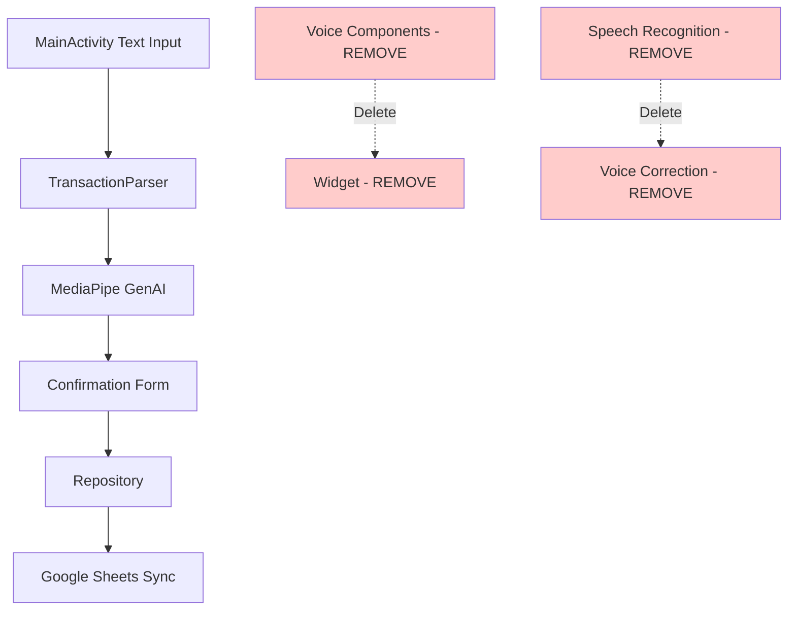

# Design Document

## Overview

This design document outlines the systematic removal of all custom voice functionality and the home screen widget from the Android expense-logging app. The goal is to significantly simplify the codebase by eliminating complex voice processing components while preserving all existing text input functionality, AI parsing, and Google Sheets integration.

The current app has extensive voice infrastructure including voice recording services, speech recognition, voice correction loops, TTS engine, and widget integration. This design provides a safe, systematic approach to remove these components without breaking the core functionality that users rely on.

## Steering Document Alignment

### Technical Standards (tech.md)

The design follows documented technical patterns by:

- **Dependency Reduction**: Removes MediaPipe speech recognition, Android SpeechRecognizer, and audio recording dependencies while maintaining MediaPipe GenAI for text parsing
- **Service Simplification**: Eliminates foreground voice recording service, reducing service complexity and potential ANR scenarios
- **Architecture Preservation**: Maintains existing MVVM patterns, Room database integration, and WorkManager sync processes
- **Build System Cleanup**: Removes voice-related dependencies from Gradle while preserving all text processing capabilities

### Project Structure (structure.md)

The implementation follows project organization conventions by:

- **Component Removal Strategy**: Systematically removing components from `ai/speech/`, `service/voice/`, `ui/confirmation/voice/`, and `ui/widget/` packages
- **Layer Preservation**: Maintaining clear separation between UI, data, and AI layers while removing voice-specific components
- **File Organization**: Following existing naming conventions during cleanup, ensuring no orphaned references remain
- **Test Structure**: Updating test organization to remove voice-related test files while preserving text parsing tests

## Code Reuse Analysis

### Existing Components to Leverage

- **TransactionParser**: Will continue to be used for text parsing, with hybrid processing preserved but voice-specific paths removed
- **MainActivity Text Input**: Existing text input field and submission logic will remain unchanged as the primary interface
- **Form Interface**: Complete form editing functionality in TransactionConfirmationActivity will be preserved
- **AI Processing Pipeline**: On-device Gemma 3 model processing for text input will remain fully functional
- **Database Layer**: All Room database operations, transaction models, and repository patterns will be unchanged
- **Google Sheets Sync**: WorkManager sync, authentication, and Apps Script integration will be preserved

### Integration Points

- **Text Parsing Flow**: MainActivity text input → TransactionParser → AI processing → form confirmation flow remains identical
- **Database Schema**: No changes to Transaction model or database schema required
- **Authentication**: OAuth flow and token storage remain unchanged
- **Configuration Management**: All settings, dropdown configurations, and user preferences are preserved

## Architecture

The removal strategy follows a "preserve core, remove periphery" approach where the central text-based workflow remains untouched while voice-specific components are systematically eliminated.

### Modular Design Principles

- **Component Isolation**: Voice components are well-isolated, making removal safe without affecting text processing
- **Service Layer Separation**: Voice recording service can be removed without affecting data layer or UI layer
- **Dependency Boundaries**: Voice-related dependencies have clear boundaries that allow clean removal
- **Interface Preservation**: Public APIs for text processing and form management remain unchanged



## Components and Interfaces

### Components to Remove

#### Voice Recording Service
- **Files**: `VoiceRecordingService.kt`, `StartVoiceActivity.kt`, `ListeningActivity.kt`
- **Purpose**: Handled voice capture, recording, and transcription
- **Dependencies**: Android SpeechRecognizer, audio permissions
- **Removal Impact**: Eliminates foreground service and associated UI flows

#### Speech Recognition Components
- **Files**: `SpeechRecognitionService.kt`, `AudioRecordingManager.kt`
- **Purpose**: Managed speech-to-text conversion and audio processing
- **Dependencies**: ML Kit Speech Recognition, audio recording
- **Removal Impact**: Removes custom speech processing pipeline

#### Voice Correction System
- **Files**: `VoiceCorrectionController.kt`, `TtsEngine.kt`, `CorrectionIntentParser.kt`, `PromptRenderer.kt`
- **Purpose**: Handled voice-based editing and correction in confirmation form
- **Dependencies**: Android TextToSpeech, voice interaction logic
- **Removal Impact**: Simplifies confirmation form to manual editing only

#### Widget Infrastructure
- **Files**: `ExpenseWidgetProvider.kt`, `widget_expense.xml`
- **Purpose**: Provided home screen widget with voice and text triggers
- **Dependencies**: Android App Widget framework
- **Removal Impact**: Removes home screen integration, focuses on main app

### Components to Preserve

#### Text Processing Core
- **Files**: `MainActivity.kt`, `TransactionParser.kt`, `HybridTransactionParser.kt`
- **Purpose**: Handles text input, AI parsing, and form generation
- **Dependencies**: MediaPipe GenAI, existing parsing infrastructure
- **Preservation**: Complete text workflow remains functional

#### Form Interface
- **Files**: `TransactionConfirmationActivity.kt`, `ConfirmationViewModel.kt`
- **Purpose**: Provides comprehensive transaction editing and validation
- **Dependencies**: Form validation, dropdown management
- **Preservation**: Manual editing capabilities fully maintained

## Data Models

### No Model Changes Required

The removal strategy does not require any changes to existing data models:

```kotlin
// Transaction model remains unchanged
data class Transaction(
    val id: String,
    val userLocalDate: LocalDate,
    val amountUsd: BigDecimal?,
    val merchant: String,
    // ... all existing fields preserved
    val source: String = "text" // Will only be "text" after removal
)
```

### Configuration Cleanup

```kotlin
// Remove voice-related configuration options
- RECORD_AUDIO permission
- Voice service declarations
- Widget provider declarations
- Speech recognition dependencies
```

## Error Handling

### Error Scenarios

1. **Broken References After Removal**
   - **Handling**: Comprehensive compilation testing after each component removal
   - **User Impact**: No impact if removal is done correctly

2. **Missing Imports/Dependencies**
   - **Handling**: Systematic dependency cleanup in build.gradle files
   - **User Impact**: App fails to build until dependencies are properly cleaned

3. **Widget Removal Impact**
   - **Handling**: Users will need to access app directly instead of via widget
   - **User Impact**: Workflow changes from widget → app to direct app access

4. **Voice Feature Discovery**
   - **Handling**: Update documentation to clarify text-only approach with Android keyboard voice option
   - **User Impact**: Users learn to use Android's built-in voice-to-text

## Testing Strategy

### Unit Testing

- **Remove Voice Tests**: Delete all test files related to voice processing, speech recognition, and voice correction
- **Preserve Text Tests**: Maintain all existing tests for text parsing, form validation, and AI processing
- **Compilation Tests**: Ensure all removed components don't leave broken references

### Integration Testing

- **Text Input Flow**: Verify complete text input → parsing → form → sync workflow still functions
- **Form Editing**: Test all manual form editing capabilities work without voice correction features
- **Configuration**: Verify settings and dropdown management still work correctly

### End-to-End Testing

- **Primary User Flow**: Text input in MainActivity → AI parsing → form confirmation → Google Sheets sync
- **Error Scenarios**: Test handling of AI parsing failures and form validation errors
- **Performance**: Verify app startup and parsing performance improve after component removal

### Removal Validation

1. **Clean Build Test**: Ensure app builds successfully after each component removal
2. **Functionality Test**: Verify all preserved features work correctly
3. **Resource Cleanup**: Confirm no unused resources remain in the project
4. **Documentation Update**: Update README and documentation to reflect simplified architecture