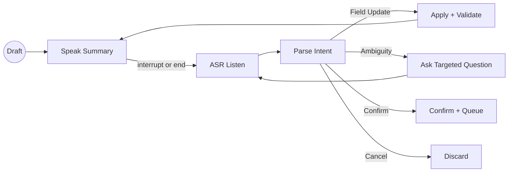

# Design Document

## Overview

Implement an on-device, voice-first correction loop that reviews a parsed transaction via concise TTS, accepts natural-language verbal corrections across key fields, detects ambiguities, and confirms or cancels hands-free. The loop runs in the confirmation screen after initial parsing and updates the draft transaction incrementally until the user confirms or cancels. Finalized items queue for Google Sheets sync.

## Steering Document Alignment

### Technical Standards (tech.md)
- Kotlin + coroutines + Flow for async streams.
- MVVM with ViewModel exposing state and one-shot effects.
- On-device only for ASR/parsing; network only for final Sheets sync.
- Room for local persistence; WorkManager for sync.

### Project Structure (structure.md)
- Follow existing packages: `ai/speech`, `ai/parsing`, `ui/confirmation`, `data/*`.
- Introduce small, single-purpose classes under `ui/confirmation/voice/` for loop orchestration and intent parsing.

## Code Reuse Analysis
- Reuse `SpeechRecognitionService` for ASR streaming (extend interface later for real ASR).
- Reuse `TransactionParser` for initial parse context (date/type defaults) when helpful in clarifications.
- Reuse `StructuredOutputValidator` to validate constraints (type validity, amount ≤ overall, no currency symbols in text fields).
- Reuse `TransactionRepository.confirm/enqueueForSync` for persistence and sync queueing.

### Existing Components to Leverage
- `ConfirmationViewModel`: extend to host loop state and expose intents/effects.
- `Transaction` + `TransactionType`: domain model for updates.
- `WorkScheduling.enqueueSyncNow`: trigger sync after confirmation.

### Integration Points
- Storage: continue to use Room via `TransactionRepository` to save status transitions.
- UI: `TransactionConfirmationActivity` wires buttons today; add voice controls and TTS prompts.

## Architecture

Introduce a small state machine orchestrating TTS prompts, ASR listening, intent parsing, transaction updates, and loop termination.

### Modular Design Principles
- Single File Responsibility: separate parser, prompt rendering, and loop controller.
- Component Isolation: ViewModel coordinates but business logic sits in dedicated classes.
- Service Layer Separation: ASR/TTS wrappers behind simple interfaces for swapability.
- Utility Modularity: intent parsing utilities testable without Android.

## Components and Interfaces

### `CorrectionIntentParser`
- Purpose: Convert free-form utterances into structured intents (field updates, confirm/cancel, repeat).
- Interfaces:
  - `fun parse(text: String, current: Transaction): CorrectionIntent`
- Dependencies: none (pure Kotlin), optional access to account/category dictionaries from Settings in future.
- Reuses: `TransactionType` for type mapping.

### `PromptRenderer`
- Purpose: Generate concise TTS strings for summary, field prompts, and clarifications (≤120 chars typical).
- Interfaces:
  - `fun summary(t: Transaction): String`
  - `fun askMissing(missing: Set<Field>): String`
  - `fun confirm(): String`
  - `fun clarify(kind: Ambiguity, candidates: List<String>): String`
- Dependencies: none; pure Kotlin.

### `TtsEngine`
- Purpose: Thin wrapper over Android TextToSpeech (or placeholder) with cancel support.
- Interfaces:
  - `suspend fun speak(text: String)`
  - `fun stop()`
- Dependencies: Android TTS; replaceable for tests.

### `VoiceCorrectionController`
- Purpose: Orchestrate loop: speak → listen → parse → apply → repeat until confirm/cancel or timeout.
- Interfaces:
  - `suspend fun start(initial: Transaction)`
  - `fun interrupt()` (stops TTS and advances to listening)
  - `fun onTranscript(text: String)` (feeds manual transcript if needed)
- Dependencies: `TtsEngine`, `SpeechRecognitionService`, `CorrectionIntentParser`, `PromptRenderer`, `StructuredOutputValidator`.
- Reuses: `TransactionRepository` via ViewModel actions for confirm/queue.

### `ConfirmationViewModel` (updates)
- Purpose: Host `LoopState`, expose intents, and emit one-shot effects for UI (speak, listen, toast).
- Interfaces:
  - State: `val transaction: StateFlow<Transaction?>`, `val loop: StateFlow<LoopState>`
  - Intents: `applyCorrection(text)`, `confirm()`, `cancel()`, `startLoop()`, `interruptTts()`
  - Effects: `val ttsEvents: Flow<String>` (text to speak), `val listenEvents: Flow<Unit>`
- Dependencies: repo, parser, controller, renderer, tts.

## Data Models

### `CorrectionIntent` (sealed class)
- SetAmount(amount: BigDecimal)
- SetMerchant(name: String)
- SetDescription(text: String)
- SetType(type: TransactionType)
- SetExpenseCategory(name: String)
- SetIncomeCategory(name: String)
- SetTags(tags: List<String>, replace: Boolean)
- SetAccount(name: String)
- SetOverallCharged(amount: BigDecimal)
- SetDate(date: LocalDate)
- Confirm
- Cancel
- Repeat
- Unknown(raw: String)

### `LoopState`
- `awaiting: PromptKind` (Summary | AskMissing | Clarify | Confirm)
- `lastPrompt: String`
- `missing: Set<Field>`
- `isSpeaking: Boolean`
- `timeouts: Timeouts` (e.g., `initial=8s`, `reprompt=8s`)

### `Field` enum
- Amount, Merchant, Description, Type, ExpenseCategory, IncomeCategory, Tags, Account, OverallCharged, Date

### `Ambiguity` enum
- AmountVsOverall, UnknownType, MalformedAmount, ConflictFields

## Error Handling

### Error Scenarios
1. Malformed amount (e.g., ambiguous decimal)
   - Handling: Ask to repeat or confirm best-guess; keep previous value.
   - User Impact: “I heard twenty three fifty — is that twenty-three point fifty?”

2. Conflicting type/category (e.g., Income + expenseCategory)
   - Handling: Clear incompatible fields and confirm change with TTS.
   - User Impact: “Setting type to Income and clearing expense category.”

3. Amount exceeds overall charged
   - Handling: Reject update; prompt for correction.
   - User Impact: “Your share can’t exceed overall charged. What’s your share?”

4. Silence/timeout
   - Handling: Reprompt once; then end without saving.
   - User Impact: “Still there? Say yes to save or a field to change.”

## Testing Strategy

### Unit Testing
- Parser: utterance → intent mapping across numbers, merchants, type, date, tags, replace vs append.
- PromptRenderer: summaries and prompts under length limits; edge cases when fields missing.
- Validator: constraints triggered correctly; conflict resolution.

### Integration Testing
- Controller loop: given transcripts sequence, updates transaction and reaches confirm/cancel.
- Interruptions: TTS stopped on new speech; loop switches to listening.

### End-to-End Testing
- ViewModel + controller happy path: parse → one correction → confirm → queued.
- Ambiguity path: two numbers → clarify → resolve → confirm.

